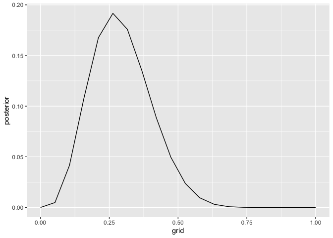
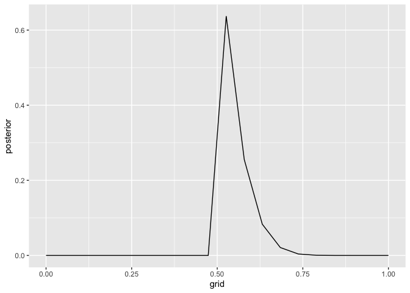

Assignment 1
================
Zack Wixom

1.  *Suppose the globe tossing data (Chapter 2) had turned out to be 4
    water in 15 tosses. Construct the posterior distribution, using grid
    approximation. Use the same flat prior as in the book.*

<!-- end list -->

    L W L W W L L W L L L L W L L 

``` r
  # 1. Define the grid.
grid_appr <- tibble(grid = seq(from = 0, to = 1, length.out = 20)) %>% 
  # 2. Set the prior.
  mutate(prior = rep(1, 20)) %>% 
  # 3. Compute the likelihood.
  mutate(likelihood = dbinom(4, size = 15, prob = grid)) %>% 
  # 4. Compute the unstandardized posterior.
  mutate(unstd_posterior = likelihood * prior) %>% 
  # 5. Standardize the posterior.
  mutate(posterior = unstd_posterior / sum(unstd_posterior))

grid_appr
```

    ## # A tibble: 20 x 5
    ##      grid prior likelihood unstd_posterior posterior
    ##     <dbl> <dbl>      <dbl>           <dbl>     <dbl>
    ##  1 0          1   0.              0.        0.      
    ##  2 0.0526     1   5.78e- 3        5.78e- 3  4.87e- 3
    ##  3 0.105      1   4.93e- 2        4.93e- 2  4.15e- 2
    ##  4 0.158      1   1.28e- 1        1.28e- 1  1.08e- 1
    ##  5 0.211      1   1.99e- 1        1.99e- 1  1.68e- 1
    ##  6 0.263      1   2.28e- 1        2.28e- 1  1.92e- 1
    ##  7 0.316      1   2.09e- 1        2.09e- 1  1.76e- 1
    ##  8 0.368      1   1.60e- 1        1.60e- 1  1.35e- 1
    ##  9 0.421      1   1.05e- 1        1.05e- 1  8.85e- 2
    ## 10 0.474      1   5.90e- 2        5.90e- 2  4.97e- 2
    ## 11 0.526      1   2.82e- 2        2.82e- 2  2.38e- 2
    ## 12 0.579      1   1.13e- 2        1.13e- 2  9.52e- 3
    ## 13 0.632      1   3.69e- 3        3.69e- 3  3.10e- 3
    ## 14 0.684      1   9.32e- 4        9.32e- 4  7.85e- 4
    ## 15 0.737      1   1.69e- 4        1.69e- 4  1.42e- 4
    ## 16 0.789      1   1.91e- 5        1.91e- 5  1.61e- 5
    ## 17 0.842      1   1.04e- 6        1.04e- 6  8.79e- 7
    ## 18 0.895      1   1.54e- 8        1.54e- 8  1.30e- 8
    ## 19 0.947      1   9.44e-12        9.44e-12  7.95e-12
    ## 20 1          1   0.              0.        0.

``` r
# Plot the grid approximation
ggplot(grid_appr, aes(x = grid, y = posterior)) +
  geom_line()
```

<!-- -->

2.  *Start over in 1, but now use a prior that is zero below p = 0.5 and
    a constant above p = 0.5. This corresponds to prior information that
    a majority of the Earth’s surface is water. What difference does the
    better prior make?*

<!-- end list -->

``` r
  # 1. Define the grid.
grid_appr <- tibble(grid = seq(from = 0, to = 1, length.out = 20)) %>% 
  # 2. Set the prior.
  mutate(prior = ifelse(grid < 0.5 , 0 , 1) ) %>% 
  # 3. Compute the likelihood.
  mutate(likelihood = dbinom(4, size = 15, prob = grid)) %>% 
  # 4. Compute the unstandardized posterior.
  mutate(unstd_posterior = likelihood * prior) %>% 
  # 5. Standardize the posterior.
  mutate(posterior = unstd_posterior / sum(unstd_posterior))

grid_appr
```

    ## # A tibble: 20 x 5
    ##      grid prior likelihood unstd_posterior posterior
    ##     <dbl> <dbl>      <dbl>           <dbl>     <dbl>
    ##  1 0          0   0.              0.        0.      
    ##  2 0.0526     0   5.78e- 3        0.        0.      
    ##  3 0.105      0   4.93e- 2        0.        0.      
    ##  4 0.158      0   1.28e- 1        0.        0.      
    ##  5 0.211      0   1.99e- 1        0.        0.      
    ##  6 0.263      0   2.28e- 1        0.        0.      
    ##  7 0.316      0   2.09e- 1        0.        0.      
    ##  8 0.368      0   1.60e- 1        0.        0.      
    ##  9 0.421      0   1.05e- 1        0.        0.      
    ## 10 0.474      0   5.90e- 2        0.        0.      
    ## 11 0.526      1   2.82e- 2        2.82e- 2  6.36e- 1
    ## 12 0.579      1   1.13e- 2        1.13e- 2  2.55e- 1
    ## 13 0.632      1   3.69e- 3        3.69e- 3  8.32e- 2
    ## 14 0.684      1   9.32e- 4        9.32e- 4  2.10e- 2
    ## 15 0.737      1   1.69e- 4        1.69e- 4  3.80e- 3
    ## 16 0.789      1   1.91e- 5        1.91e- 5  4.31e- 4
    ## 17 0.842      1   1.04e- 6        1.04e- 6  2.35e- 5
    ## 18 0.895      1   1.54e- 8        1.54e- 8  3.47e- 7
    ## 19 0.947      1   9.44e-12        9.44e-12  2.13e-10
    ## 20 1          1   0.              0.        0.

``` r
# Plot the grid approximation
ggplot(grid_appr, aes(x = grid, y = posterior)) +
  geom_line()
```

<!-- -->

3.  *For the posterior distribution from 2, compute 89% percentile and
    HPDI intervals. Compare the widths of these intervals.*

<!-- end list -->

``` r
# Sample
grid_appr_sample <- sample(
  grid_appr$grid, 
  prob = grid_appr$posterior, 
  size = 10000, 
  replace = TRUE
)

# Percentile
pi_int <- PI(grid_appr_sample, prob = 0.89)

pi_int
```

    ##        5%       94% 
    ## 0.5263158 0.6315789

``` r
# HPDI
hpdi_int <- HPDI(grid_appr_sample, prob = 0.89)

hpdi_int
```

    ##     |0.89     0.89| 
    ## 0.5263158 0.5789474

*Which is wider? Why? *

The Percentile Interval is wider and I think that is because the HPDI
takes a denser interval by including the highest point.

*If you had only the information in the interval, what might you
misunderstand about the shape of the posterior distribution?*

Since both the PI and HPDI are pretty similar that that means that the
shape is more or less bell-shaped (or at least that’s what it sounded
like happens in the book), however, I am sure that the shape can be
misunderstood by just looking at these numbers, you would need to plot
them to figure out the true shape.

*Questions from the assignment:*

  - How do you determine the size of the grid. In the book he did 20
    with only 9 tosses. Is it normal to make your grid larger than your
    number of observed data? Why not make them the same?

  - Does the size matter when sampling form the posterior?

  - How do you plot the PI and HPDI on a existing graph? Is there a way
    to add the shading?

  - I am slightly confused about how the PI and HPDI can help you
    determine the shape of the distrubtion. Maybe there is something I
    missed from the reading.
