Assignment 2
================
Zack Wixom

``` r
# Packages
library(tidyverse)
library(cmdstanr)
library(posterior)
library(bayesplot)
library(rethinking)

# Set seed
set.seed(42)

# Get Data
data(Howell1)
d <- Howell1

d2 <- d[d$age >= 18, ]
```

1.  The weights listed below were recorded in the !Kung census, but
    heights were not recorded for these individuals. Provide predicted
    heights and 89% compatibility intervals for each of these
    individuals.

That is, fill in the table below, using model-based predictions.

Individual weight expected height 89% interval 1 45 2 40 3 65 4 31

``` r
# define average weight
xbar <- mean(d2$weight)

# Fit Model
m1 <- quap(
  alist(
    height ~ dnorm(mu, sigma),
    mu <- a + b*(weight - xbar),
    a ~ dnorm(178, 20),
    b ~ dnorm(0, 1),
    sigma ~ dunif(0, 50)
  ), data = d2
)

# # Get samples
# post <- extract.samples(m1)

# Define Sequence
weight.seq <- as.vector(c(45, 40, 65, 31))

# link
mu <- link(m1, data = data.frame(weight = weight.seq))

# visualize
plot(height ~ weight, d2, type = "n")

for(i in 1:100)
  points(weight.seq, mu[i,], pch = 16, col = col.alpha(rangi2, 0.1))
```

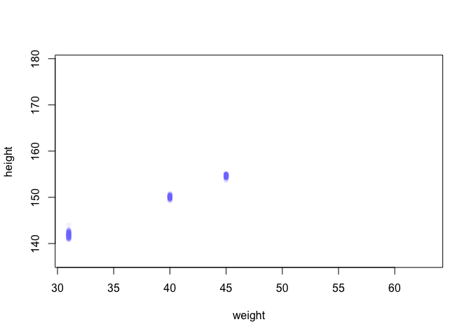<!-- -->

``` r
# Summarize
mu.mean <- apply(mu, 2, mean)
mu.PI <- apply(mu, 2, PI, prob = 0.89)

# plot
plot(height ~ weight, data = d2, col = col.alpha(rangi2, 0.5))

# MAP line
lines(weight.seq, mu.mean)

#Shade
shade(mu.PI, weight.seq)
```

<!-- -->

Not sure if this is how to get the answer haha. I was able to make a
dataframe that was only 4 columns corresponding to the weights we were
given but I am not sure if that is what we are suppose to get or not. I
continued to follow the code to plot another chart but not sure what to
think of it except it fit the model with the line. I don’t know how to
get exact values for those weights.

Let we continue doing something with `sim()`

``` r
# Simulate height
sim.height <- sim(m1, data = list(weight = weight.seq))

# summarize heights
height.PI <- apply(sim.height, 2, PI, prob = 0.89)

# plot
plot(height ~ weight, d2, col = col.alpha(rangi2, 0.5))

# Draw map line
lines(weight.seq, mu.mean)

#share
shade(mu.PI, weight.seq)

# PI region of hieght
shade(height.PI, weight.seq)
```

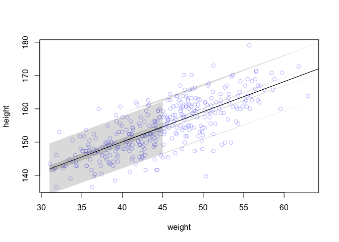<!-- -->

Alright so now I have a compatability interval for where the predicted
heights corresponding to the weights might be.

This was attempted with his code from the book which is a little
confusing since he likes to go into depth of how each step works so I
get lost in his process. So I am going to reproduce Marc’s code since he
does it differently and see what my results are like.

``` r
# 1. Specify the number of lines to simulate.
N <- 100
prior_pd <- tibble(
  # 2. Specify the line number.
  n = 1:N,
  # 3. Simulate values of beta0 and beta1 from their priors.
  beta0 = rnorm(N, 178, 20), # beta0 ∼ Normal(178, 20)
  beta1 = rnorm(N, 0, 10)    # beta1 ~ Normal(0, 10)
) %>%
  # 4. Create two rows for each line, one for each end of the range.
  expand(nesting(n, beta0, beta1), weight = weight.seq) %>% 
  mutate(
    # 5. Simulate average height using the linear model:
    # mu_i = beta0 + beta1 * (weight_i - avg_weight)
    height = beta0 + beta1 * (weight - mean(d2$weight)),
  )
# Plot the prior predictive distribution regression lines.
prior_pd %>% 
  ggplot(aes(x = weight, y = height, group = n)) +
  geom_line(alpha = 0.10)
```

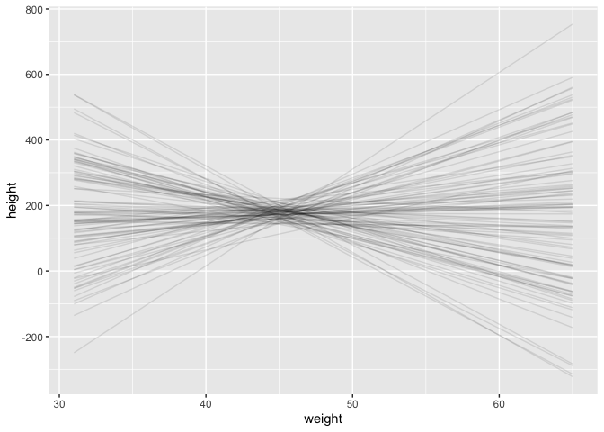<!-- -->

Well that didn’t help very much haha

Well maybe I am not supposed to use the mean of the new sequence they
gave us in the model??

``` r
# Define Sequence
weight.seq <- as.vector(c(45, 40, 65, 31))

# define average weight
xbar <- mean(weight.seq)

# Fit Model
m1.1 <- quap(
  alist(
    height ~ dnorm(mu, sigma),
    mu <- a + b*(weight - xbar),
    a ~ dnorm(178, 20),
    b ~ dnorm(0, 1),
    sigma ~ dunif(0, 50)
  ), data = d2
)

precis(m1.1)
```

    ##              mean         sd        5.5%       94.5%
    ## a     154.8357874 0.27052591 154.4034347 155.2681400
    ## b       0.9034673 0.04189135   0.8365168   0.9704177
    ## sigma   5.0718780 0.19115446   4.7663762   5.3773797

``` r
# link
mu <- link(m1.1, data = data.frame(weight = weight.seq))

# visualize
plot(height ~ weight, d2, type = "n")

for(i in 1:100)
  points(weight.seq, mu[i,], pch = 16, col = col.alpha(rangi2, 0.1))
```

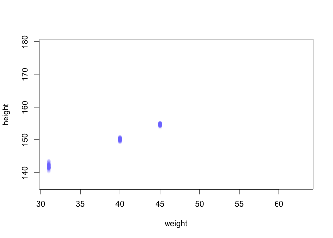<!-- -->

``` r
# Summarize
mu.mean <- apply(mu, 2, mean)
mu.PI <- apply(mu, 2, PI, prob = 0.89)

# plot
plot(height ~ weight, data = d2, col = col.alpha(rangi2, 0.5))

# MAP line
lines(weight.seq, mu.mean)

#Shade
shade(mu.PI, weight.seq)
```

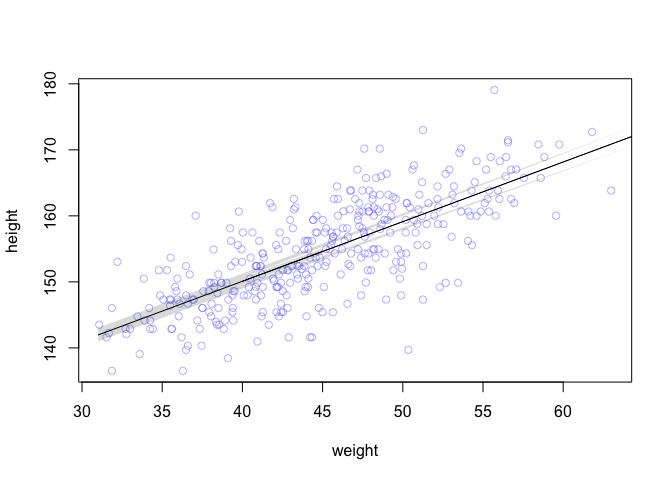<!-- -->

Maybe not, those two both look the exact same.

Ok, maybe I am doing this wrong the whole time. I am looking at figure
4.8 in the book and this might be what I am suppose to do so that I can
get the intervals of heights and the compatibility interval at each
weight.

``` r
# define average weight
xbar <- mean(d2$weight)

weight.seq <- as.vector(c(45, 40, 65, 31))

# Fit Model
m1.2 <- quap(
  alist(
    height ~ dnorm(mu, sigma),
    mu <- a + b*(weight - xbar),
    a ~ dnorm(178, 20),
    b ~ dnorm(0, 1),
    sigma ~ dunif(0, 50)
  ), data = d2
)

# Extract Samples
post <- extract.samples(m1.2)

# Weight = 45
mu_at_45 <- post$a + post$b * (45 - xbar)
dens(mu_at_45, col = rangi2, lwd = 2, xlab = "mu | weight = 45")
```

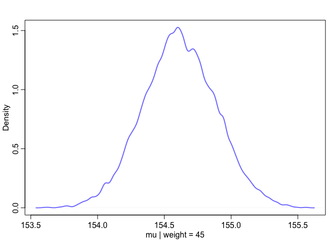<!-- -->

``` r
PI(mu_at_45, prob = 0.89)
```

    ##       5%      94% 
    ## 154.1810 155.0516

``` r
# Weight = 40
mu_at_40 <- post$a + post$b * (40 - xbar)
dens(mu_at_40, col = rangi2, lwd = 2, xlab = "mu | weight = 40")
```

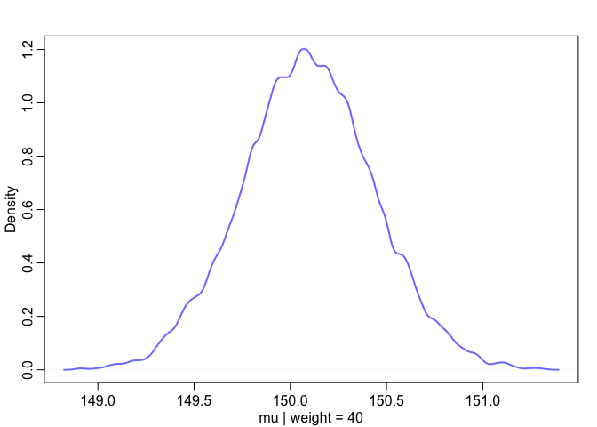<!-- -->

``` r
PI(mu_at_40, prob = 0.89)
```

    ##       5%      94% 
    ## 149.5367 150.6438

``` r
# Weight = 65
mu_at_65 <- post$a + post$b * (65 - xbar)
dens(mu_at_65, col = rangi2, lwd = 2, xlab = "mu | weight = 65")
```

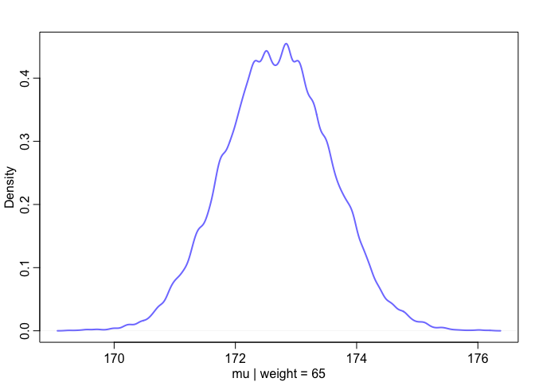<!-- -->

``` r
PI(mu_at_65, prob = 0.89)  
```

    ##       5%      94% 
    ## 171.2900 174.0973

``` r
# Weight = 31
mu_at_31 <- post$a + post$b * (31 - xbar)
dens(mu_at_31, col = rangi2, lwd = 2, xlab = "mu | weight = 31")
```

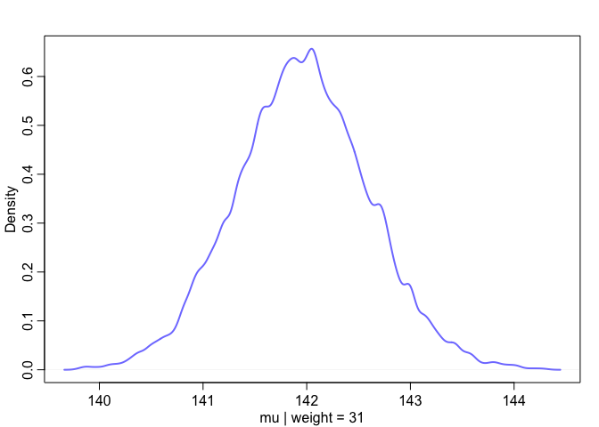<!-- -->

``` r
PI(mu_at_31, prob = 0.89)
```

    ##       5%      94% 
    ## 140.9289 142.9959

Alright I am feeling a lot better about this haha I am not sure if I am
suppose to find a range of possible heights or if I just do the averge
based on the distribution.

-   For weight 45 = the height is between 154.2 and 155.04

-   For weight 40 = the height is between 149.6 and 150.6

-   For weight 65 = the height is between 171.3 and 174.1

-   For weight 31 = the height is between 141.0 and 143.0

I am not sure if this is the same thing if you do the height.PI using
sim()

``` r
# Simulate height
sim.height <- sim(m1.2, data = list(weight = weight.seq))

# summarize heights
height.PI <- apply(sim.height, 2, PI, prob = 0.89)

height.PI
```

    ##         [,1]     [,2]     [,3]     [,4]
    ## 5%  146.9728 142.5247 165.1779 133.9964
    ## 94% 162.9088 157.8888 181.0176 149.8337

I got different intervals by using sim() not sure why that would be.
THese are a wider spread than when I just did the PI of each mu at the
weight. I don’t know which one is the better one to look at. Perhaps mu
at each weight isn’t actually giving me the predicted heights.

Ok, well I am gonna move onto number 2.

1.  Model the relationship between height (cm) and the natural logarithm
    of weight (log-kg): log(weight). Use the entire Howell1 data frame,
    all 544 rows, adults and non-adults. Use any model type from Chapter
    4 that you think useful: an ordinary linear regression, a polynomial
    or a spline. I recommend a plain linear regression, though. Plot the
    posterior predictions against the raw data.

``` r
# Get Data
data(Howell1)

#use all the data
d <- Howell1

d$weight_s <- (d$weight - mean(d$weight)) / sd(d$weight)

d$weight_s2 <- d$weight_s^2

# define average weight
xbar <- mean(d$weight)

# Fit Model
m2 <- quap(
  alist(
    height ~ dnorm(mu, sigma),
    mu <- a + b1*weight_s + b2*weight_s2,
    a ~ dnorm(178, 20),
    b1 ~ dlnorm(0, 1),
    b2 ~ dnorm(0,1),
    sigma ~ dunif(0, 50)
  ), data = d
)

# Weight sequence
weight.seq <- seq(-2.2, 2, length.out = 30)

pred_dat <- list(weight_s = weight.seq, weight_s2 = weight.seq^2)

# link
mu <- link(m2, data = pred_dat)
mu.mean <- apply(mu, 2, mean)
mu.PI <- apply(mu, 2, PI, prob = 0.89)
sim.height <- sim(m2, data = pred_dat)
height.PI <- apply(sim.height, 2, PI, prob = 0.89)

# plot
plot(height ~ weight_s, data = d, col = col.alpha(rangi2, 0.5))
lines(weight.seq, mu.mean)
shade(mu.PI, weight.seq)
shade(height.PI, weight.seq)
```

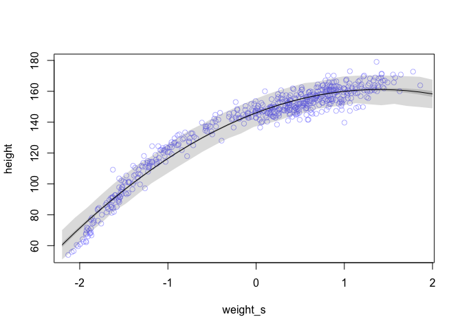<!-- -->

1.  Plot the prior predictive distribution for the polynomial regression
    model in Chapter 4. You can modify the the code that plots the
    linear regression prior predictive distribution. 20 or 30 parabolas
    from the prior should suffice to show where the prior probability
    resides. Can you modify the prior distributions of α, β1, and β2 so
    that the prior predictions stay within the biologically reasonable
    outcome space? That is to say: Do not try to fit the data by hand.
    But do try to keep the curves consistent with what you know about
    height and weight, before seeing these exact data.

``` r
set.seed(42)

N <- 30 # 30 lines
a <- rnorm(N, 178, 20)
b1 <- dlnorm(N, 0, 1)
b2 <- rnorm(N, 0, 1)

d$weight_s <- (d$weight - mean(d$weight)) / sd(d$weight)

d$weight_s2 <- d$weight_s^2

xbar <- mean(d$weight)

plot( NULL, xlim=range(d$weight), ylim=c(-100,400),
  xlab="weight", ylab= "height" )

abline( h=0 , lty=2 )

abline( h=272 , lty=1 , lwd=0.5 )


for ( i in 1:N ) curve( a[i] + b1[i]*((x - xbar)/sd(x)) + b2[i]*(((x - xbar)/sd(x))^2),
  from=min(d$weight), to=max(d$weight), add=TRUE,
  col=col.alpha("black", 0.2))
```

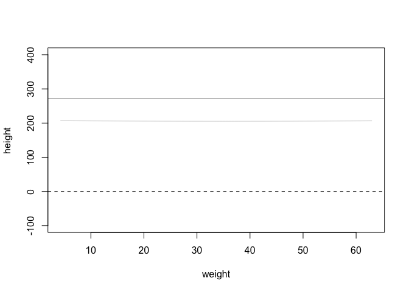<!-- -->

Well I thought I modified the code from the linear regression to make
parabols but it didn’t seem to work. Not sure how to make the lines
parabolic with this kind of code.
