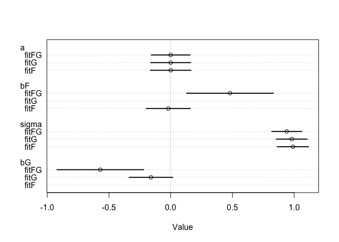

Assignment 3
================
Zack Wixom

1.  Use a model to infer the total causal influence of **area on
    weight**. Would increasing the area available to each fox make it
    heavier (healthier)?

*You might want to standardize the variables. Regardless, use prior
predictive simulation to show that your model’s prior predictions stay
within the possible outcome range.*

**Step 1:** list all possible paths

1.  area –&gt; avgfood –&gt; weight

2.  area –&gt; avgfood –&gt; groupsize –&gt; weight

**Step 2:** Classify each path

1.  A –&gt; F –&gt; W = Pipe

2.  A –&gt; F –&gt; G –&gt; W = Pipe

No back doors her

**Step 3:** Conditioning

``` r
# Standardize Variables
d <- as_tibble(foxes) %>% 
  mutate(
    A = standardize(area),
    F = standardize(avgfood),
    W = standardize(weight),
    G = standardize(groupsize)
  )

# Make Dag to look at what to condition on

dag_01 <- dagitty( "dag {
  A -> F -> W
  A -> F -> G -> W
}")

plot(dag_01)
```

    ## Plot coordinates for graph not supplied! Generating coordinates, see ?coordinates for how to set your own.

<!-- -->

``` r
# Check for conditioning
adjustmentSets(dag_01, exposure = "A", outcome = "W")
```

    ##  {}

``` r
impliedConditionalIndependencies(dag_01)
```

    ## A _||_ G | F
    ## A _||_ W | F

``` r
# Fit Model for Area
fit01 <- quap(
  alist(
    W ~ dnorm(mu, sigma),
    mu <- a + bA*A,
    a ~ dnorm(0, 0.2),
    bA ~ dnorm(0, 0.5),
    sigma ~ dexp(1)
  ), data = d
)

set.seed(42)

prior01 <- extract.prior(fit01)

# Use link() to compute mu without having to write out the linear function.
mu <- link(fit01, post = prior01, data = list(A = c(-2, 2)))

# Base plot plus "layers".
plot(NULL, xlim = c(-2, 2), ylim = c(-2,2))
for (i in 1:50) {
  lines(c(-2, 2), mu[i,], col = col.alpha("black",0.4))
}
```

<!-- -->

``` r
# Fit Model for AvgFood
fit02 <- quap(
  alist(
    W ~ dnorm(mu, sigma),
    mu <- a + bF*F,
    a ~ dnorm(0, 0.2),
    bF ~ dnorm(0, 0.5),
    sigma ~ dexp(1)
  ), data = d
)

set.seed(42)

prior02 <- extract.prior(fit02)

# Use link() to compute mu without having to write out the linear function.
mu <- link(fit02, post = prior02, data = list(F = c(-2, 2)))

# Base plot plus "layers".
plot(NULL, xlim = c(-2, 2), ylim = c(-2,2))
for (i in 1:50) {
  lines(c(-2, 2), mu[i,], col = col.alpha("black",0.4))
}
```

<!-- -->

``` r
# Fit Model for GroupSize
fit03 <- quap(
  alist(
    W ~ dnorm(mu, sigma),
    mu <- a + bG*G,
    a ~ dnorm(0, 0.2),
    bG ~ dnorm(0, 0.5),
    sigma ~ dexp(1)
  ), data = d
)

set.seed(42)

prior03 <- extract.prior(fit03)

# Use link() to compute mu without having to write out the linear function.
mu <- link(fit03, post = prior03, data = list(G = c(-2, 2)))

# Base plot plus "layers".
plot(NULL, xlim = c(-2, 2), ylim = c(-2,2))
for (i in 1:50) {
  lines(c(-2, 2), mu[i,], col = col.alpha("black",0.4))
}
```

<!-- -->

Well I don’t know if my priors are good,not sure how to tell so I am
going to move on to combining the variables.

``` r
# Fit model for Dag 1
fitAF <- quap(
  alist(
    W ~ dnorm(mu, sigma),
    mu <- a + bA*A + bF*F,
    a ~ dnorm(0, 0.2),
    bA ~ dnorm(0, 0.5),
    bF ~ dnorm(0, 0.5),
    sigma ~ dexp(1)
  ), data = d
)

precis(fitAF)
```

    ##                mean         sd       5.5%     94.5%
    ## a      3.460322e-07 0.08334401 -0.1331995 0.1332002
    ## bA     1.461373e-01 0.17418823 -0.1322491 0.4245238
    ## bF    -1.490380e-01 0.17418840 -0.4274247 0.1293487
    ## sigma  9.874676e-01 0.06444163  0.8844774 1.0904578

``` r
# Fit model for Dag 2
fitAFG <- quap(
  alist(
    W ~ dnorm(mu, sigma),
    mu <- a + bA*A + bF*F + bG*G,
    a ~ dnorm(0, 0.2),
    bA ~ dnorm(0, 0.5),
    bF ~ dnorm(0, 0.5),
    bG ~ dnorm(0, 0.5),
    sigma ~ dexp(1)
  ), data = d
)

precis(fitAFG)
```

    ##                mean         sd         5.5%      94.5%
    ## a     -1.674817e-09 0.07936205 -0.126835888  0.1268359
    ## bA     2.782380e-01 0.17011236  0.006365569  0.5501104
    ## bF     2.968992e-01 0.20960033 -0.038082607  0.6318810
    ## bG    -6.396196e-01 0.18161493 -0.929875295 -0.3493638
    ## sigma  9.312069e-01 0.06100018  0.833716858  1.0286970

``` r
# Fit model without F
fitAG <- quap(
  alist(
    W ~ dnorm(mu, sigma),
    mu <- a + bA*A + bG*G,
    a ~ dnorm(0, 0.2),
    bA ~ dnorm(0, 0.5),
    bG ~ dnorm(0, 0.5),
    sigma ~ dexp(1)
  ), data = d
)

precis(fitAG)
```

    ##                mean         sd       5.5%      94.5%
    ## a      1.466347e-08 0.08013108 -0.1280649  0.1280650
    ## bA     4.058528e-01 0.14536266  0.1735352  0.6381704
    ## bG    -4.820002e-01 0.14537268 -0.7143338 -0.2496665
    ## sigma  9.419461e-01 0.06159418  0.8435067  1.0403855

``` r
# Plot all models together
plot(coeftab(fitAF, fitAG, fitAFG))
```

<!-- --> In general as area gets
bigger then the healthier the foxes are. However, there seems to be an
association between groupsize and area where the larger the group the
less healthy. There seems to be something happening between avgfood and
groupsize that is changing the outcome. When adding avgfood to the model
with groupsize there avgfood size spikes from negative to positive.

1.  Now infer the causal impact of adding food (avgfood) to a territory.
    Would this make foxes heavier? Which covariates do you need to
    adjust for to estimate the total causal influence of food?

avgfood on weight. backdoor is area.

I am going to model without area to see what happens

``` r
# Fit model for food and weight
fitF <- quap(
  alist(
    W ~ dnorm(mu, sigma),
    mu <- a + bF*F,
    a ~ dnorm(0, 0.2),
    bF ~ dnorm(0, 0.5),
    sigma ~ dexp(1)
  ), data = d
)

precis(fitF)
```

    ##                mean         sd       5.5%     94.5%
    ## a      4.069105e-07 0.08360009 -0.1336087 0.1336095
    ## bF    -2.421190e-02 0.09088492 -0.1694636 0.1210397
    ## sigma  9.911428e-01 0.06465840  0.8878062 1.0944794

``` r
# Fit model for groupsize and weight
fitG <- quap(
  alist(
    W ~ dnorm(mu, sigma),
    mu <- a + bG*G,
    a ~ dnorm(0, 0.2),
    bG ~ dnorm(0, 0.5),
    sigma ~ dexp(1)
  ), data = d
)

precis(fitG)
```

    ##                mean         sd       5.5%       94.5%
    ## a     -6.560802e-08 0.08272319 -0.1322077  0.13220757
    ## bG    -1.558039e-01 0.08977327 -0.2992789 -0.01232889
    ## sigma  9.785871e-01 0.06384616  0.8765486  1.08062562

``` r
# Fit model for food groupsize and weight
fitFG <- quap(
  alist(
    W ~ dnorm(mu, sigma),
    mu <- a + bF*F + bG*G,
    a ~ dnorm(0, 0.2),
    bF ~ dnorm(0, 0.5),
    bG ~ dnorm(0, 0.5),
    sigma ~ dexp(1)
  ), data = d
)

precis(fitFG)
```

    ##                mean         sd       5.5%      94.5%
    ## a      2.103966e-07 0.08013799 -0.1280758  0.1280762
    ## bF     4.772530e-01 0.17912306  0.1909798  0.7635263
    ## bG    -5.735259e-01 0.17914155 -0.8598287 -0.2872231
    ## sigma  9.420428e-01 0.06175237  0.8433506  1.0407350

``` r
# Plot all models together
plot(coeftab(fitF, fitG, fitFG))
```

<!-- --> Perhaps avgfood has no
impact at all until you account for groupsize or area. these two
variables you would need to adjust.

1.  Now infer the causal impact of group size. Which covariates do you
    need to adjust for? Looking at the posterior distribution of the
    resulting model, what do you think explains these data? That is, can
    you explain the estimates for all three problems? How do they make
    sense together?

I kind of already checked out groupsize with the previous models and it
looks like avgfood is the variable that needs to be adjusted becuase it
affects groupsize the most. I think that this is happening becuase the
more foxes in a group the more average food they will need to eat so the
groupsize is negative association with weight since you have to increase
avgfood inorder for there to be enough food for the larger group.

So in general the area increases the weight of the foxes when you also
increase the average food, however increasing the groupsize will
negatively affect the weight.

**Questions I have:**

I mentioned this is class on Tuesday, but I don’t understand how to pick
priors. I am basically just using from examples we have had in the book
but I don’t really know what would be best given the data. Since the
data is standardized I am doing the same thing as when we standardized
for the WafflesDivorce data model.

I don’t think I understand what the code should be for conditioning on a
variable. Does conditioning mean to include the variable or to not
include the variable when fitting the model? I think I am getting mixed
up because of the example form the book of including the recall variable
in the model lead to no result so we took it out and it improved the
model (I think haha)

Also I hope I am interpreting the plots correctly, might not be haha.
Cause I am curious that in my example, the area dips once you add
groupsize to the model. Is it ok that once you add a variable it
influences another one? I guess this is just showing how the variables
are associated but I am wondering about when to add variables versus
when not to add variables? Of course after looking at the DAGs you will
know which variables influence each other so that can help you decide.
