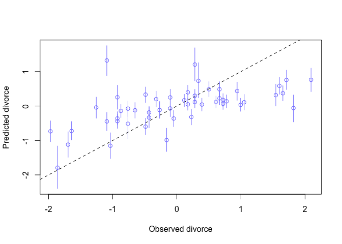
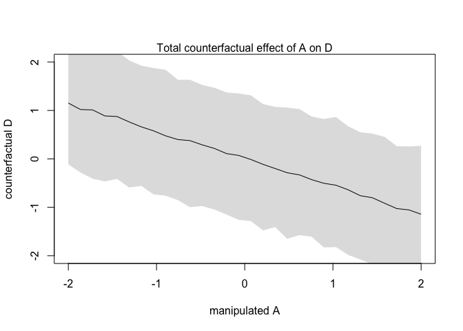
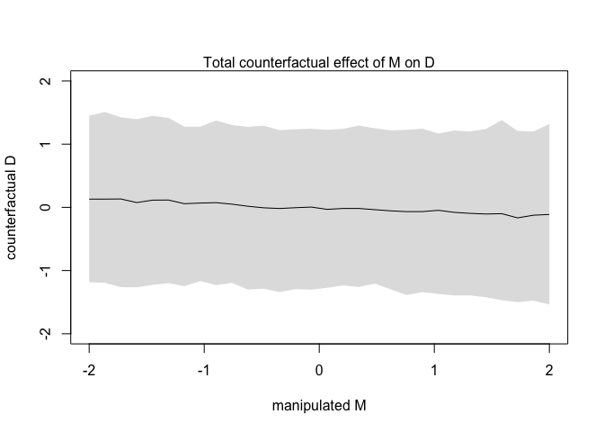
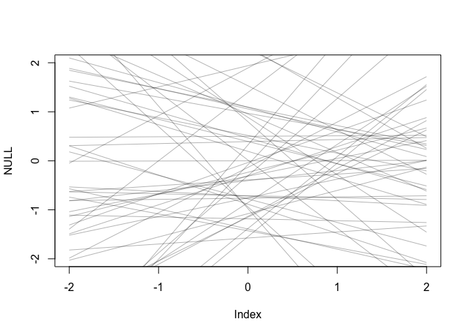
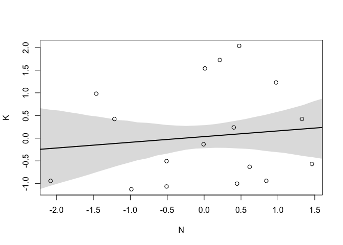
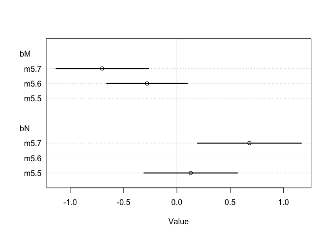
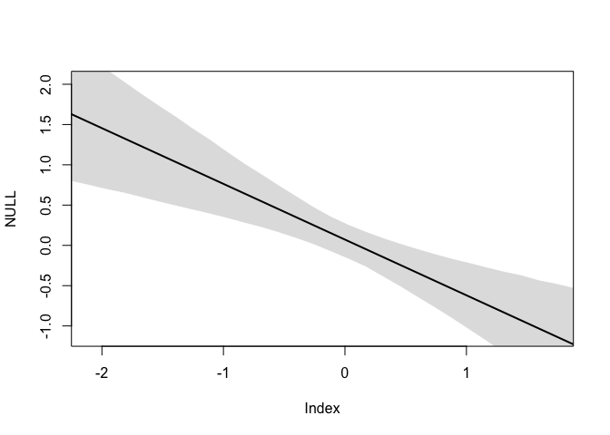
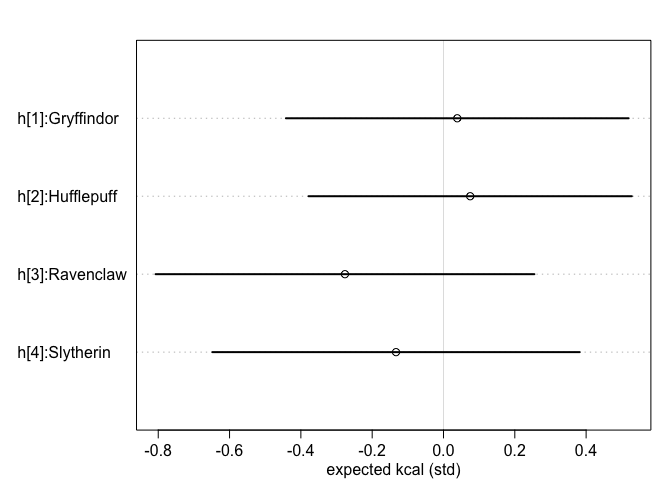

Spurious Waffles
================
Zack Wixom

## Waffles and Divorce


## Correlations

Commonplace in nature.

*Caution* can be misleading.

Correlation does not imply Causation and vice versa.

Causation implies *conditional* correlation

## Multiple Regression Models

*Using more than one predictor variable to model an outcome*.

**The Good**

-   Reveal spurious correlations

-   Uncover masked associations

**The Bad**

-   Causes spurious correlations and confounds

-   Hides real associations

**The DAGs**

-   Tool for Casual Models with causal implications

-   Allows you to describe qualitiative casual relationships among
    variables

## Reasons for Multiple Regression

1.  Statistical controls for *confounds*.

2.  Multiple and complex causation.

3.  Interactions.

**Confounds**

Misleads us about a causal influence, such as the Waffle House
correlation with Divorce. Makes some variables with no real importance
look important.

Sometimes confounds hide important effects as well.

**Complex Causation**

must measure causes simultaneously becuase there can be multiple causes
happening at the same time and cascading in complex ways.

**Interactions**

Importance of one variable can depend on another. Interactions happen
often so must consider others to get correct effective inference.

## Spurious Association

We are looking at different variables that are associated with divorce.
Marriage Rate (positive association) and the Median Age at Marriage
(negative association).

``` r
# Load packages
library(tidyverse)
```

    ## ── Attaching packages ─────────────────────────────────────── tidyverse 1.3.0 ──

    ## ✓ ggplot2 3.3.3     ✓ purrr   0.3.4
    ## ✓ tibble  3.0.5     ✓ dplyr   1.0.2
    ## ✓ tidyr   1.1.2     ✓ stringr 1.4.0
    ## ✓ readr   1.4.0     ✓ forcats 0.5.0

    ## ── Conflicts ────────────────────────────────────────── tidyverse_conflicts() ──
    ## x dplyr::filter() masks stats::filter()
    ## x dplyr::lag()    masks stats::lag()

``` r
library(rethinking)
```

    ## Loading required package: rstan

    ## Loading required package: StanHeaders

    ## rstan (Version 2.21.2, GitRev: 2e1f913d3ca3)

    ## For execution on a local, multicore CPU with excess RAM we recommend calling
    ## options(mc.cores = parallel::detectCores()).
    ## To avoid recompilation of unchanged Stan programs, we recommend calling
    ## rstan_options(auto_write = TRUE)

    ## 
    ## Attaching package: 'rstan'

    ## The following object is masked from 'package:tidyr':
    ## 
    ##     extract

    ## Loading required package: parallel

    ## rethinking (Version 2.13)

    ## 
    ## Attaching package: 'rethinking'

    ## The following object is masked from 'package:purrr':
    ## 
    ##     map

    ## The following object is masked from 'package:stats':
    ## 
    ##     rstudent

``` r
# Load Data
data(WaffleDivorce)
d <- WaffleDivorce

# Standardize Variables
d$D <- standardize(d$Divorce)           # Divorce Rate
d$M <- standardize(d$Marriage)          # Marriage Rate
d$A <- standardize(d$MedianAgeMarriage) # Median Age at marriage
```

D = standardized divorce rate for the state

A = standardized median age at marriage for the state

M = standardized marriage rate for the state

Since we standardized the variables we expect the mean of a to be around
zero.

In order to know if there is a strong relationship or not, you need to
know the standard deviation of age at marriage.

``` r
sd(d$MedianAgeMarriage)
```

    ## [1] 1.24363

So when there is a prior slope of 1 then a change of 1.2 years in median
age is associated.

??

## Median Age and Divorce

``` r
# Fitting model

m5.1 <- quap(
  alist(
    D ~ dnorm(mu, sigma),
    mu <- a + bA * A,        # Median Age as Predictor
    a ~ dnorm(0, 0.2),
    bA ~ dnorm(0, 0.5),
    sigma ~ dexp(1)
  ), data = d
)
```

What is dexp() doing here?

### Simulating from the priors

Using `extract.prior` and `link` then plot lines over the range of 2
standard deviatiosn for both the outcome and predictor.

``` r
set.seed(10)

prior <- extract.prior(m5.1)

mu <- link(m5.1, post = prior, data = list(A = c(-2, 2)))

plot(NULL, xlim = c(-2, 2), ylim = c(-2,2))
for (i in 1:50) {
  lines(c(-2,2), mu[i,], col = col.alpha("black", 0.4))
}
```

<!-- -->

### Posterior Predictions

``` r
# Compute percentile interval of mean
A_seq <- seq(-3, 3.2, length.out = 30)
mu <- link(m5.1, data = list(A = A_seq))
mu.mean <- apply(mu, 2, mean)
mu.PI <- apply(mu, 2, PI)

# Plot 
plot(D ~ A, data = d, col = rangi2)
lines(A_seq, mu.mean, lwd = 2)
shade(mu.PI, A_seq)
```

<!-- -->

There is a negative relationship for Median Age posteriors. `precis`
confirms this as well.

``` r
precis(m5.1)
```

    ##                mean         sd       5.5%      94.5%
    ## a     -1.717587e-08 0.09737874 -0.1556300  0.1556300
    ## bA    -5.684031e-01 0.10999976 -0.7442040 -0.3926022
    ## sigma  7.883253e-01 0.07801125  0.6636483  0.9130024

## Marriage rate and Divorce

``` r
## Model
m5.2 <- quap(
  alist(
    D ~ dnorm(mu, sigma),
    mu <- a + bM * M,        # Marriage Rate as Predictor
    a ~ dnorm(0, 0.2),
    bM ~ dnorm(0, 0.5),
    sigma ~ dexp(1)
  ), data = d
)

## Simulating Priors

set.seed(10)

prior <- extract.prior(m5.2)

mu <- link(m5.2, post = prior, data = list(M = c(-2, 2)))

plot(NULL, xlim = c(-2, 2), ylim = c(-2,2))
for (i in 1:50) {
  lines(c(-2,2), mu[i,], col = col.alpha("black", 0.4))
}
```

<!-- -->

``` r
## Posterior Predictions

# Compute percentile interval of mean
M_seq <- seq(-3, 3.2, length.out = 30)
mu <- link(m5.2, data = list(M = M_seq))
mu.mean <- apply(mu, 2, mean)
mu.PI <- apply(mu, 2, PI)

# Plot 
plot(D ~ M, data = d, col = rangi2)
lines(M_seq, mu.mean, lwd = 2)
shade(mu.PI, M_seq)
```

<!-- -->

There is a positive relationship from the posteriors of Marriage Rate,
but not as strong as the Median Age.

``` r
precis(m5.2)
```

    ##               mean         sd       5.5%     94.5%
    ## a     2.918047e-07 0.10824642 -0.1729984 0.1729990
    ## bM    3.500540e-01 0.12592744  0.1487977 0.5513104
    ## sigma 9.102653e-01 0.08986239  0.7666479 1.0538828

## Directed Acyclic Graph


DAGs will tell you the consequences of interveneing to change a variable
if the DAG is correct.

What is happening?

1.  A *directly influences* D

2.  M *directly influences* D

3.  A *directly influences* M

We need more than one model to infer the strength of each relationship.

**Mediation** relationships are where a variable has no direct effect on
outcome but is still associated with the outcome through an indirect
relationship with another variable.

``` r
library(dagitty)
dag5.1 <- dagitty("dag{A -> D; A -> M; M -> D}")
coordinates(dag5.1) <- list(x = c(A = 0, D = 1, M = 2), y = c(A = 0, D = 1, M = 0))
drawdag(dag5.1)
```

<!-- -->

## Testable Implications

How we use data to compare multiple plausible causal model.

Any DAG may imply that some variables are independent of others under
certain conditions.

**Conditional Independencies**

1.  Which variables are associated or not with another in the data.

2.  Which variables become *dis-associated* when we condition on some
    other set of variables.


### Right DAG

Shows the implied conditional independencies

``` r
DMA_dag2 <- dagitty('dag{D <- A -> M}')
impliedConditionalIndependencies(DMA_dag2)
```

    ## D _||_ M | A

### Left DAG

No conditional independecies

``` r
DMA_dag1 <- dagitty('dag{D <- A -> M -> D}')
impliedConditionalIndependencies(DMA_dag1)
```

In order to test the implied conditional independencies for Right DAG we
need to condition on Variable A. Then we can see if D is independent of
M by using Multiple Regression.

The question we want to answer:

*After I already know Variable A, what addiitonal value is there in also
knowing Variable B?*

## Multiple Regression Notation

1.  Nominate the predictor variables.

2.  Make parameter that will measure its conditional association.

3.  Multiply the parameter by the variable and add that term to model.


### Approximating the posterior

Code to approximate the posterior distribution

``` r
m5.3 <- quap(
  alist(
    D ~ dnorm(mu, sigma),
    mu <- a + bM*M + bA*A,
    a ~ dnorm(0, 0.2),
    bM ~ dnorm(0, 0.5),
    bA ~ dnorm(0, 0.5),
    sigma ~ dexp(1)
  ), data = d
)

precis(m5.3)
```

    ##                mean         sd       5.5%      94.5%
    ## a     -1.100372e-05 0.09708000 -0.1551636  0.1551416
    ## bM    -6.537672e-02 0.15078010 -0.3063524  0.1755990
    ## bA    -6.135168e-01 0.15099056 -0.8548289 -0.3722047
    ## sigma  7.851600e-01 0.07785376  0.6607347  0.9095854

Let’s plot all of the models sides by side

``` r
plot(coeftab(m5.1, m5.2, m5.3), par = c("bA", "bM"))
```

<!-- -->

bA or the posterior mean for median age at marriage is almost unchanged.

### Simulating the Divorce

``` r
N <- 50                 # Number of simulated States
age <- rnorm(N)         # Sim A
mar <- rnorm(N, -age)   # Sim A -> M
div <- rnorm(N, age)    # Sim A -> D
```

## Ploting Multivariate Posteriors

let’s visualize the model’s inferences so we can understand. With only
one predictor variable we can use a scatter plot.

**Predictor Residual Plot**

Show outcome against residual predictor values. Good for understanding
statistical models.

Since we standardized the variables we expect the mean of a to be around
zero.

``` r
m5.4 <- quap(
  alist(
    M ~ dnorm(mu, sigma),
    mu <- a + bAM * A,
    a ~ dnorm(0, 0.2),
    bAM ~ dnorm(0, 0.5),
    sigma ~ dexp(1)
  ), data = d
)

# Compute Residuals

mu <- link(m5.4)
mu_mean <- apply(mu, 2, mean)
mu_resid <- d$M - mu_mean
```

When a residual is positive that means that the observed rate was in
excess of what the model expects, given the median age at marriage in
that state.

States with postitive residuals have high marriage rates for their
median age and those with negative residuals have low marriage rates for
their age.

*Note*: Residuals are parameters not data. Can’t use them in another
model.

**Posterior Prediction Plot**

Model based predictions against raw data. They are tools for checking
fit and assessing predictions. Not causal tools.

Two uses

-   Did model correctly approximated the posterior distribution?

-   Does the model fail?

``` r
# Call link without specifying new data so it uses the original data
mu <- link(m5.3)

# Summarize samples across cases
mu_mean <- apply(mu, 2, mean)
mu_PI <- apply(mu, 2, PI)

# Simulate observation again no new data
D_sim <- sim(m5.3, n = 1e4)
D_PI <- apply(D_sim, 2, PI)

# Plot predictions
plot(mu_mean ~ d$D, col = rangi2, ylim = range(mu_PI),
     xlab = "Observed divorce", ylab = "Predicted divorce")

abline(a = 0, b = 1, lty = 2)

for (i in 1:nrow(d)) {
  lines(rep(d$D[i], 2), mu_PI[,i], col = rangi2)
}
```

<!-- -->

Not sure how this works

``` r
# identify(x = d$D, y = mu_mean, labels = d$Loc)
```

*Shoutout to Mormons*

## Simulating Spurious association

``` r
N <- 100                            # number of cases
x_real <- rnorm(N)                  # Gaussian with mean 0, sd 1
x_spur <- rnorm(N, x_real)          # Gaussian with mean = x_real
y <- rnorm(N, x_real)               # Gaussian with mean = x_real
d <- data.frame(y, x_real, x_spur)  # bind all together in data frame
```

x\_real is influencing both y and x\_spur. Both x\_spur and x\_real are
correlated with y.

**Counterfactual Plot**

Show the implied predictions for imaginary experiments. Allow you to
explore the causal implications of manipulating one or more variables.

They can be produced for any values of the predictor variables you like.

How to generate plots that take causal structure into account:

1.  Pick variable to manipulate, the intervention variable.

2.  Define the range of values to set the intervention variable to.

3.  For each value of the intervention variable, and for each sample in
    posterior, use the causal model to simulate the values of other
    variables, including the outcome.

We are going to simulatre form the DAG from before.

``` r
data(WaffleDivorce)
d <- list()
d$A <- standardize(WaffleDivorce$MedianAgeMarriage)
d$D <- standardize(WaffleDivorce$Divorce)
d$M <- standardize(WaffleDivorce$Marriage)
m5.3_A <- quap(
  alist(
    ## A -> D <- M
    D ~ dnorm(mu, sigma),
    mu <- a + bM*M + bA*A,
    a ~ dnorm(0, 0.2),
    bM ~ dnorm(0, 0.5),
    bA ~ dnorm(0, 0.5),
    sigma ~ dexp(1),
    ## A -> M
    M ~ dnorm(mu_M, sigma_M),
    mu_M <- aM + bAM*A,
    aM ~ dnorm(0, 0.2),
    bAM ~ dnorm(0, 0.5),
    sigma_M ~ dexp(1)
  ), data = d
)

precis(m5.3_A)
```

    ##                  mean         sd       5.5%      94.5%
    ## a        4.529261e-07 0.09707601 -0.1551458  0.1551467
    ## bM      -6.538079e-02 0.15077302 -0.3063452  0.1755836
    ## bA      -6.135136e-01 0.15098355 -0.8548145 -0.3722127
    ## sigma    7.851177e-01 0.07784333  0.6607091  0.9095264
    ## aM      -5.395004e-08 0.08684783 -0.1387997  0.1387996
    ## bAM     -6.947376e-01 0.09572693 -0.8477277 -0.5417475
    ## sigma_M  6.817369e-01 0.06758005  0.5737309  0.7897428

The goal is to simulate so we get a range of values for A

``` r
A_seq <- seq(from = -2, to = 2, length.out = 30)

# Prep Data
sim_dat <- data.frame(A = A_seq)

# Simulate M and then D, using A_seq
s <- sim(m5.3_A, data = sim_dat, vars = c("M", "D"))


# Plot
plot(sim_dat$A, colMeans(s$D), ylim = c(-2, 2), type = "l",
     xlab = "manipulated A", ylab = "counterfactual D")
shade(apply(s$D, 2, PI), sim_dat$A)
mtext("Total counterfactual effect of A on D")
```

<!-- -->

You can also get numerical summaries

``` r
# New data frame, standardized to mean 26.1 and sd 1.24
sim2_dat <- data.frame(A = (c(20, 30)-26.1)/1.24)
s2 <- sim(m5.3_A, data = sim2_dat, vars = c("M", "D"))
mean(s2$D[,2] - s2$D[,1])
```

    ## [1] -4.590242

This is a huge effect of four and one half stdeviations so probably
impossible.

The trick with simulating counterfactuals is to realize that when we
manipulate some variable X, we break the casual influence of other
variables on X.

``` r
sim_dat <- data.frame(M = seq(from = -2, to = 2, length.out = 30), A = 0)
s <- sim(m5.3_A, data = sim_dat, vars = "D")

plot(sim_dat$M, colMeans(s), ylim = c(-2,2), type = "l",
     xlab = "manipulated M", ylab = "counterfactual D")
shade(apply(s,2, PI), sim_dat$M)
mtext("Total counterfactual effect of M on D")
```

<!-- -->

``` r
A_seq <- seq(from = -2, to = 2, length.out = 30)

post <- extract.samples(m5.3_A)
M_sim <- with(post, sapply(1:30,
  function(i) rnorm(1e3, aM + bAM*A_seq[i], sigma_M)))


D_sim <- with(post, sapply(1:30,
  function(i) rnorm(1e3, a + bA*A_seq[i] + bM*M_sim[,i],sigma)))
```

## Masked Relationship

Association between outcome and predictor masked by another variable.

Arises when there are two predictor variables that are correlated with
one another. One is positive correlation and one is negative
correlation.

The second reason to use more than one predictor variables is to measure
direct influences of multiple factors on an outcome, when none of those
influences is apparent from bivariate relationships.

milk dataset has NA’s present. We need to use Complete Case Analysis

``` r
data(milk)
d <- milk
str(d)
```

    ## 'data.frame':    29 obs. of  8 variables:
    ##  $ clade         : Factor w/ 4 levels "Ape","New World Monkey",..: 4 4 4 4 4 2 2 2 2 2 ...
    ##  $ species       : Factor w/ 29 levels "A palliata","Alouatta seniculus",..: 11 8 9 10 16 2 1 6 28 27 ...
    ##  $ kcal.per.g    : num  0.49 0.51 0.46 0.48 0.6 0.47 0.56 0.89 0.91 0.92 ...
    ##  $ perc.fat      : num  16.6 19.3 14.1 14.9 27.3 ...
    ##  $ perc.protein  : num  15.4 16.9 16.9 13.2 19.5 ...
    ##  $ perc.lactose  : num  68 63.8 69 71.9 53.2 ...
    ##  $ mass          : num  1.95 2.09 2.51 1.62 2.19 5.25 5.37 2.51 0.71 0.68 ...
    ##  $ neocortex.perc: num  55.2 NA NA NA NA ...

``` r
# Standardize 

d$K <- standardize(d$kcal.per.g)
d$N <- standardize(d$neocortex.perc)
d$M <- standardize(log(d$mass))

# m5.5_draft <- quap(
#   alist(
#     K ~ dnorm(mu, sigma),
#     mu <- a + bN*N,
#     a ~ dnorm(0,1),
#     bN ~ dnorm(0, 1),
#     sigma ~ dexp(1)
#   ), data = d
# )

d$neocortex.perc
```

    ##  [1] 55.16    NA    NA    NA    NA 64.54 64.54 67.64    NA 68.85 58.85 61.69
    ## [13] 60.32    NA    NA 69.97    NA 70.41    NA 73.40    NA 67.53    NA 71.26
    ## [25] 72.60    NA 70.24 76.30 75.49

``` r
# Use only complete cases
dcc <- d[complete.cases(d$K, d$N, d$M), ]

m5.5_draft <- quap(
  alist(
    K ~ dnorm(mu, sigma),
    mu <- a + bN*N,
    a ~ dnorm(0,1),
    bN ~ dnorm(0,1),
    sigma ~ dexp(1)
  ), data = dcc
)
```

Look at those prior

``` r
prior <- extract.prior(m5.5_draft)
xseq <- c(-2,2)
mu <- link(m5.5_draft, post = prior, data = list(N = xseq))

plot(NULL, xlim = xseq, ylim = xseq)
for (i in 1:50) {
  lines(xseq, mu[i, ], col = col.alpha("black", 0.3))
}
```

<!-- -->

Need to contrain prior distributions or this happens. We make them
closer to 0.

``` r
m5.5 <- quap(
  alist(
    K ~ dnorm(mu, sigma),
    mu <- a + bN*N,
    a ~ dnorm(0,0.2),
    bN ~ dnorm(0,0.5),
    sigma ~ dexp(1)
  ), data = dcc
)

precis(m5.5)
```

    ##             mean        sd       5.5%     94.5%
    ## a     0.03993978 0.1544908 -0.2069663 0.2868459
    ## bN    0.13323511 0.2237469 -0.2243557 0.4908259
    ## sigma 0.99982056 0.1647081  0.7365851 1.2630560

``` r
xseq <- seq(min(dcc$N)-0.15, max(dcc$N)+0.15, length.out = 30)
mu <- link(m5.5, data = list(N = xseq))
mu_mean <- apply(mu, 2, mean)
mu_PI <- apply(mu, 2, PI)

plot(K ~ N, data = dcc)
lines(xseq, mu_mean, lwd = 2)
shade(mu_PI, xseq)
```

<!-- -->

Let’s consider another predictor varialbe

``` r
m5.6 <- quap(
  alist(
    K ~ dnorm(mu, sigma),
    mu <- a + bM*M,
    a ~ dnorm(0,0.2),
    bM ~ dnorm(0,0.5),
    sigma ~ dexp(1)
  ), data = dcc
)

precis(m5.6)
```

    ##              mean        sd       5.5%     94.5%
    ## a      0.04654172 0.1512800 -0.1952329 0.2883163
    ## bM    -0.28253567 0.1928817 -0.5907978 0.0257265
    ## sigma  0.94927870 0.1570612  0.6982645 1.2002929

Combining the two models to make a multiple regression model

``` r
m5.7 <- quap(
  alist(
    K ~ dnorm(mu, sigma),
    mu <- a + bN*N + bM*M,
    a ~ dnorm(0,0.2),
    bN ~ dnorm(0, 0.5),
    bM ~ dnorm(0,0.5),
    sigma ~ dexp(1)
  ), data = dcc
)

precis(m5.7)
```

    ##              mean        sd       5.5%      94.5%
    ## a      0.06799158 0.1339987 -0.1461641  0.2821473
    ## bN     0.67511817 0.2482985  0.2782893  1.0719471
    ## bM    -0.70299061 0.2207870 -1.0558508 -0.3501304
    ## sigma  0.73801392 0.1324617  0.5263146  0.9497132

Let’s plot them all together

``` r
plot(coeftab(m5.5, m5.6, m5.7), pars = c("bM", "bN"))
```

<!-- -->

The posterior means are moved away form zero when in one model. so
adding both predictors seems to cause this

``` r
xseq <- seq( from=min(dcc$M)-0.15 , to=max(dcc$M)+0.15 , length.out=30 )
mu <- link( m5.7 , data=data.frame( M=xseq , N=0 ) )
mu_mean <- apply(mu,2,mean)
mu_PI <- apply(mu,2,PI)
plot( NULL , xlim=range(dcc$M) , ylim=range(dcc$K) )
lines( xseq , mu_mean , lwd=2 )
shade( mu_PI , xseq )
```

<!-- -->

### Simulating Masking Relationship

``` r
# M -> K <- N
# M -> N
n <- 100
M <- rnorm( n )
N <- rnorm( n , M )
K <- rnorm( n , N - M )
d_sim <- data.frame(K=K,N=N,M=M)

# M -> K <- N
# N -> M
n <- 100
N <- rnorm( n )
M <- rnorm( n , N )
K <- rnorm( n , N - M )
d_sim2 <- data.frame(K=K,N=N,M=M)

# M -> K <- N
# M <- U -> N
n <- 100
U <- rnorm( n )
N <- rnorm( n , U )
M <- rnorm( n , U )
K <- rnorm( n , N - M )
d_sim3 <- data.frame(K=K,N=N,M=M)


dag5.7 <- dagitty("dag{ 
                  M -> K <- N
                  M -> N }")
coordinates(dag5.7) <- list( x = c(M = 0, K = 1, N = 2), y = c(M = 0, K = 1, N = 0.5))
MElist <- equivalentDAGs(dag5.7)
```

Creates list of all the DAGS

## Categorical Variables

Many predictors are discrete.

Two approaches

1.  Use Dummy Variables

2.  Use Index Variables

``` r
data(Howell1)
d <- Howell1

d$sex <- ifelse(d$male == 1, 2, 1)
str(d$sex)
```

    ##  num [1:544] 2 1 1 2 1 2 1 2 1 2 ...

This creates a list of alpha parameters one for each unique value in the
index variable. we end up with a1 and a2

lets approximate the posterior

``` r
m5.8 <- quap(
  alist(
    height ~ dnorm(mu, sigma),
    mu <- a[sex],
    a[sex] ~ dnorm(178, 20),
    sigma ~ dunif(0, 50)
  ), data = d
)

precis(m5.8, depth = 2)
```

    ##            mean        sd      5.5%     94.5%
    ## a[1]  134.91062 1.6069395 132.34242 137.47882
    ## a[2]  142.57803 1.6974792 139.86513 145.29093
    ## sigma  27.31007 0.8280503  25.98668  28.63345

``` r
# depth tells use to show any vector parameters
```

If we want to know the expected difference between these paramters?

sample from posterior

``` r
post <- extract.samples(m5.8)
post$diff_fm <- post$a[,1] - post$a[,2]
precis(post, depth = 2)
```

    ##               mean        sd      5.5%      94.5%       histogram
    ## sigma    27.308143 0.8257961  26.00415  28.628998 ▁▁▁▁▁▃▇▇▇▃▂▁▁▁▁
    ## a[1]    134.925758 1.6094198 132.38558 137.493622  ▁▁▁▁▂▅▇▇▅▂▁▁▁▁
    ## a[2]    142.572596 1.7103205 139.79818 145.327573  ▁▁▁▂▃▇▇▇▃▂▁▁▁▁
    ## diff_fm  -7.646839 2.3414125 -11.36959  -3.878438      ▁▁▁▂▇▇▃▁▁▁

When it gets more complicated you need to keep track of which index goes
with which categories.

``` r
data(milk)
d <- milk

# inspect levels
levels(d$clade)
```

    ## [1] "Ape"              "New World Monkey" "Old World Monkey" "Strepsirrhine"

``` r
# index the variable
d$clade_id <- as.integer(d$clade)

# random hogwarts assignment
set.seed(63)
d$house <- sample(rep(1:4, each = 8), size = nrow(d))

# Make model
m5.10 <- quap(
  alist(
    K ~ dnorm(mu, sigma),
    mu <- a[clade_id] + h[house],
    a[clade_id] ~ dnorm(0, 0.5),
    h[house] ~ dnorm(0, 0.5),
    sigma ~ dexp(1)
  ), data = d
)

precis(m5.10, depth = 2)
```

    ##              mean        sd       5.5%      94.5%
    ## a[1]   0.03862785 0.3007042 -0.4419555 0.51921124
    ## a[2]   0.07489486 0.2836392 -0.3784154 0.52820516
    ## a[3]  -0.27633554 0.3323597 -0.8075106 0.25483952
    ## a[4]  -0.13310428 0.3222888 -0.6481840 0.38197543
    ## h[1]   0.35476745 0.2946583 -0.1161534 0.82568834
    ## h[2]  -0.41463974 0.3129273 -0.9147580 0.08547853
    ## h[3]  -0.13113729 0.2995491 -0.6098746 0.34760003
    ## h[4]  -0.10442090 0.3244538 -0.6229607 0.41411894
    ## sigma  1.59504971 0.1120423  1.4159845 1.77411491

``` r
labels <- paste("h[", 1:4, "]:", c("Gryffindor", "Hufflepuff", "Ravenclaw", "Slytherin"), sep = "")

plot(precis(m5.10, depth = 2, pars = "a"), labels = labels, xlab = "expected kcal (std)")
```

<!-- -->
