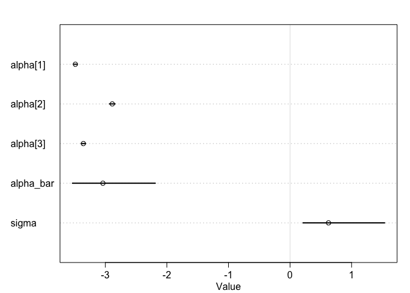
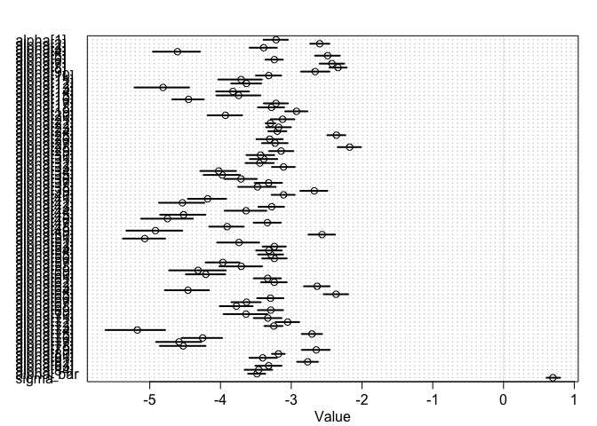
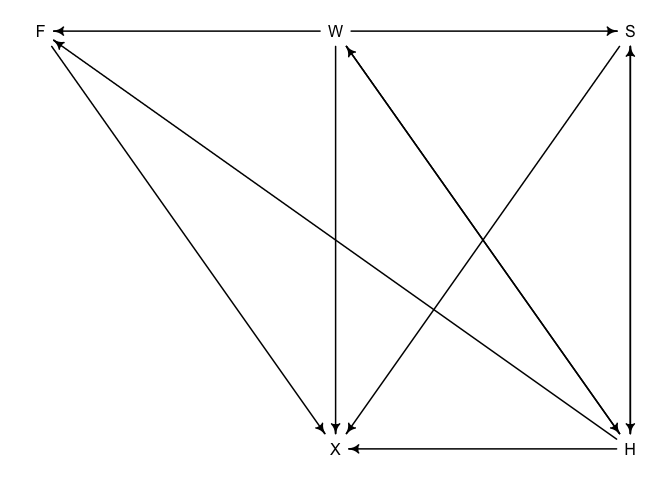
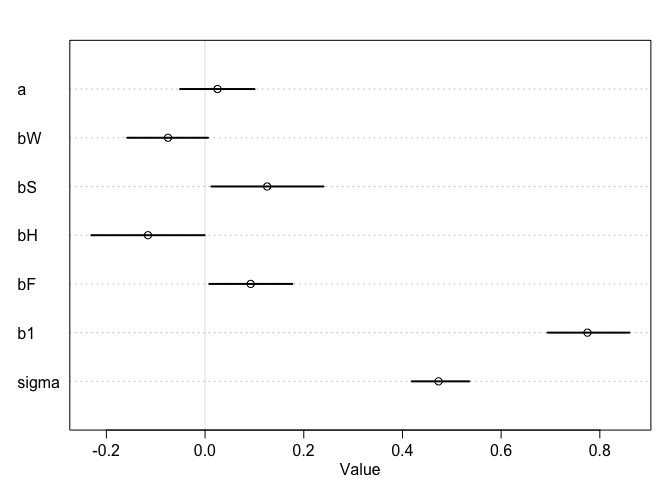
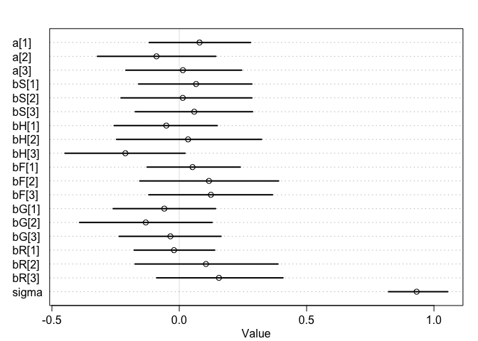
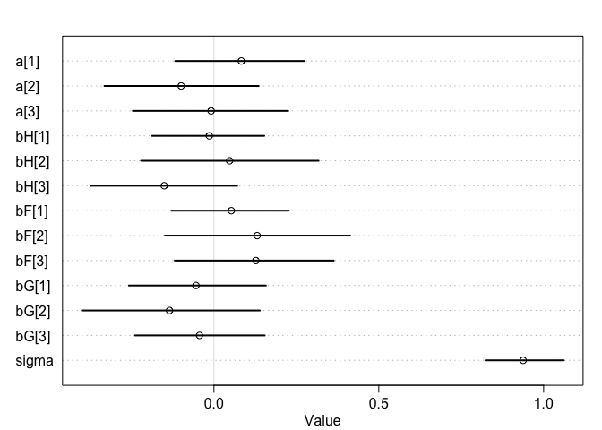
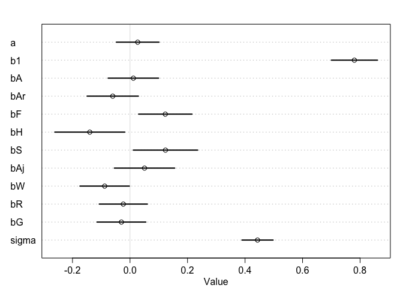

Smash Analysis
================
Zack Wixom


> First of all, I want to state that this is not finished. There is
> still so much to explore and understand with this data. I believe I
> have come up with a general idea of what is going on, however, I
> didn’t have enough time to finish before the end of the semester. I
> am going to continue working on this as much as I can after the
> semester since it is something really interesting to me personally.

``` r
# Packages
library(tidyverse)
library(cmdstanr)
library(posterior)
library(bayesplot)
library(rethinking)
library(dagitty)

# Load Data
smash_tidy <- read_csv(here::here("Project", "Data", "smash_tidy.csv"))

smash_tidy
```

    ## # A tibble: 106 x 14
    ##    character total_players per_played string1 base_accel Air.speed Fast.Fall
    ##    <chr>             <dbl>      <dbl>   <dbl> <chr>          <dbl>     <dbl>
    ##  1 Cloud               190       3.66     102 0.01           1.16       2.69
    ##  2 Bayonetta           151       2.91      26 0.01           1.02       2.83
    ##  3 Terry               135       2.6       46 <NA>           0.95       2.37
    ##  4 Joker               114       2.2       44 <NA>           1.1        3.10
    ##  5 Ganondorf           110       2.12      35 0.01           0.83       2.64
    ##  6 Young Li…           129       2.48      26 0.02           0.966      2.88
    ##  7 Snake                97       1.87      39 0.01           0.987      2.77
    ##  8 Inkling              95       1.83      35 0.01           1.21       2.53
    ##  9 Inkling              95       1.83      35 0.01           1.21       2.53
    ## 10 Marth                93       1.79      31 0.01           1.07       2.53
    ## # … with 96 more rows, and 7 more variables: fullhop_height <chr>,
    ## #   shorthop_height <chr>, airjump_height <chr>, Weight <dbl>, Run.Speed <dbl>,
    ## #   Grab.Range <chr>, oos_move <chr>

``` r
# Set Seed
set.seed(42)
```

## Data Manipulation

There is still things I need to tidy and manipulate in order to get some
of the models I want to use to work.

I am going to try to make weight a discrete variable by classifying
characters into weight classes. *Heavy*, *Medium*, and *Light*.

``` r
# Find tertiles
vTert = quantile(smash_tidy$Weight, c(0:3/3), na.rm = T)

# classify values
smash_tidy$weight_class = with(smash_tidy, 
                               cut(Weight, 
                                   vTert, 
                                   include.lowest = T, 
                                   labels = c("Light", "Medium", "Heavy")))

# Inspect new variable compared to ids and original weight
smash_tidy %>% 
  select(character, Weight, weight_class)
```

    ## # A tibble: 106 x 3
    ##    character  Weight weight_class
    ##    <chr>       <dbl> <fct>       
    ##  1 Cloud         100 Heavy       
    ##  2 Bayonetta      81 Light       
    ##  3 Terry         108 Heavy       
    ##  4 Joker          93 Medium      
    ##  5 Ganondorf     118 Heavy       
    ##  6 Young Link     88 Light       
    ##  7 Snake         106 Heavy       
    ##  8 Inkling        94 Medium      
    ##  9 Inkling        94 Medium      
    ## 10 Marth          90 Light       
    ## # … with 96 more rows

``` r
# Create player count variable
weightclasses <- smash_tidy %>%
  group_by(weight_class) %>%                             # group by weightclass and summarize
  summarize(
    name = unique(character),
    w_count = n_distinct(name)
  ) %>% 
  group_by(weight_class) %>% 
  summarize(
    w_count = n()
  )
```

    ## `summarise()` regrouping output by 'weight_class' (override with `.groups` argument)

    ## `summarise()` ungrouping output (override with `.groups` argument)

``` r
# Find frequency of character
smash_freq <- as.data.frame(table(smash_tidy$character)) %>% 
  rename(
    character = Var1
  )

# check for counts per unique instance of characters by dividing by frequency of character in data
smash_freq_count <- smash_tidy %>% 
  group_by(character, weight_class) %>% 
  summarize(
    x = sum(total_players, na.rm = T)
  ) %>% 
  inner_join(smash_freq, by = "character") %>% 
  mutate(
    count = x/Freq
  )
```

    ## `summarise()` regrouping output by 'character' (override with `.groups` argument)

``` r
# find density per weight class
smash_density <- smash_freq_count %>% 
  group_by(weight_class) %>% 
  summarize(
    w_density = sum(count)
  )
```

    ## `summarise()` ungrouping output (override with `.groups` argument)

``` r
# finally join and drop na's
smash_weights <- smash_tidy %>% 
  inner_join(smash_density, by = "weight_class") %>% 
  drop_na(total_players)

smash_weights
```

    ## # A tibble: 101 x 16
    ##    character total_players per_played string1 base_accel Air.speed Fast.Fall
    ##    <chr>             <dbl>      <dbl>   <dbl> <chr>          <dbl>     <dbl>
    ##  1 Cloud               190       3.66     102 0.01           1.16       2.69
    ##  2 Bayonetta           151       2.91      26 0.01           1.02       2.83
    ##  3 Terry               135       2.6       46 <NA>           0.95       2.37
    ##  4 Joker               114       2.2       44 <NA>           1.1        3.10
    ##  5 Ganondorf           110       2.12      35 0.01           0.83       2.64
    ##  6 Young Li…           129       2.48      26 0.02           0.966      2.88
    ##  7 Snake                97       1.87      39 0.01           0.987      2.77
    ##  8 Inkling              95       1.83      35 0.01           1.21       2.53
    ##  9 Inkling              95       1.83      35 0.01           1.21       2.53
    ## 10 Marth                93       1.79      31 0.01           1.07       2.53
    ## # … with 91 more rows, and 9 more variables: fullhop_height <chr>,
    ## #   shorthop_height <chr>, airjump_height <chr>, Weight <dbl>, Run.Speed <dbl>,
    ## #   Grab.Range <chr>, oos_move <chr>, weight_class <fct>, w_density <dbl>

Now that we have the data in the right format, let’s try to run this
model.

## Binomial Model

> This model is based off the reedfrogs example from the book.

However I need to conver the outcome varialbe `played` into a count.
Since the data is in the form of percentage played I know that this data
comes from 5,436 players. So I will be able to calculate the count
easily.

I am going to run it by indexing on weight class first. Then I will do
it by character.

``` r
# Standardize and Index Variables
smash2.8 <- list(
  played = smash_weights$total_players,
  w_class = as.integer(smash_weights$weight_class),    # weight Class indicator
  w_density = smash_weights$w_density,                 # Density of players per class
  character = as.integer(factor(smash_weights$character)),     # each character 
  total_characters = rep(5361, nrow(smash_weights))                             # Total number of players
)

# Fit the model with ulam().
m2.8 <- ulam(
  alist(
    played ~ dbinom(w_density, p),         # survival_i ~ Binomail(density_i, p_i)
    logit(p) <- alpha[w_class],               # logit(p_i) = alpha[tank]_i
    alpha[w_class] ~ dnorm(alpha_bar, sigma), # alpha_i ~ Normal(alpha_bar, sigma)
    alpha_bar ~ dnorm(0, 1.5),             # alpha_bar ~ Normal(0, 1.5)
    sigma ~ dexp(1)                        
  ),
  data = smash2.8, # Specify the data list instead of a data frame.
  log_lik = TRUE,   # Include the log-likelihood to compute fit.
  chains = 4,       # Specify the number of chains.
  cores = 4,        # Specify the number of cores to run in parallel.
  cmdstan = TRUE    # Specify cmdstan = TRUE to use cmdstanr instead of rstan.
)
```

    ## Compiling Stan program...

    ## Running MCMC with 4 parallel chains, with 1 thread(s) per chain...
    ## 
    ## Chain 1 Iteration:   1 / 1000 [  0%]  (Warmup) 
    ## Chain 2 Iteration:   1 / 1000 [  0%]  (Warmup) 
    ## Chain 3 Iteration:   1 / 1000 [  0%]  (Warmup) 
    ## Chain 4 Iteration:   1 / 1000 [  0%]  (Warmup) 
    ## Chain 4 Iteration: 100 / 1000 [ 10%]  (Warmup) 
    ## Chain 1 Iteration: 100 / 1000 [ 10%]  (Warmup) 
    ## Chain 1 Iteration: 200 / 1000 [ 20%]  (Warmup) 
    ## Chain 2 Iteration: 100 / 1000 [ 10%]  (Warmup) 
    ## Chain 2 Iteration: 200 / 1000 [ 20%]  (Warmup) 
    ## Chain 3 Iteration: 100 / 1000 [ 10%]  (Warmup) 
    ## Chain 3 Iteration: 200 / 1000 [ 20%]  (Warmup) 
    ## Chain 4 Iteration: 200 / 1000 [ 20%]  (Warmup) 
    ## Chain 4 Iteration: 300 / 1000 [ 30%]  (Warmup) 
    ## Chain 1 Iteration: 300 / 1000 [ 30%]  (Warmup) 
    ## Chain 2 Iteration: 300 / 1000 [ 30%]  (Warmup) 
    ## Chain 2 Iteration: 400 / 1000 [ 40%]  (Warmup) 
    ## Chain 3 Iteration: 300 / 1000 [ 30%]  (Warmup) 
    ## Chain 3 Iteration: 400 / 1000 [ 40%]  (Warmup) 
    ## Chain 3 Iteration: 500 / 1000 [ 50%]  (Warmup) 
    ## Chain 4 Iteration: 400 / 1000 [ 40%]  (Warmup) 
    ## Chain 4 Iteration: 500 / 1000 [ 50%]  (Warmup) 
    ## Chain 4 Iteration: 501 / 1000 [ 50%]  (Sampling) 
    ## Chain 1 Iteration: 400 / 1000 [ 40%]  (Warmup) 
    ## Chain 1 Iteration: 500 / 1000 [ 50%]  (Warmup) 
    ## Chain 1 Iteration: 501 / 1000 [ 50%]  (Sampling) 
    ## Chain 2 Iteration: 500 / 1000 [ 50%]  (Warmup) 
    ## Chain 2 Iteration: 501 / 1000 [ 50%]  (Sampling) 
    ## Chain 3 Iteration: 501 / 1000 [ 50%]  (Sampling) 
    ## Chain 3 Iteration: 600 / 1000 [ 60%]  (Sampling) 
    ## Chain 3 Iteration: 700 / 1000 [ 70%]  (Sampling) 
    ## Chain 4 Iteration: 600 / 1000 [ 60%]  (Sampling) 
    ## Chain 4 Iteration: 700 / 1000 [ 70%]  (Sampling) 
    ## Chain 1 Iteration: 600 / 1000 [ 60%]  (Sampling) 
    ## Chain 1 Iteration: 700 / 1000 [ 70%]  (Sampling) 
    ## Chain 2 Iteration: 600 / 1000 [ 60%]  (Sampling) 
    ## Chain 2 Iteration: 700 / 1000 [ 70%]  (Sampling) 
    ## Chain 2 Iteration: 800 / 1000 [ 80%]  (Sampling) 
    ## Chain 3 Iteration: 800 / 1000 [ 80%]  (Sampling) 
    ## Chain 3 Iteration: 900 / 1000 [ 90%]  (Sampling) 
    ## Chain 4 Iteration: 800 / 1000 [ 80%]  (Sampling) 
    ## Chain 4 Iteration: 900 / 1000 [ 90%]  (Sampling) 
    ## Chain 1 Iteration: 800 / 1000 [ 80%]  (Sampling) 
    ## Chain 1 Iteration: 900 / 1000 [ 90%]  (Sampling) 
    ## Chain 1 Iteration: 1000 / 1000 [100%]  (Sampling) 
    ## Chain 2 Iteration: 900 / 1000 [ 90%]  (Sampling) 
    ## Chain 2 Iteration: 1000 / 1000 [100%]  (Sampling) 
    ## Chain 3 Iteration: 1000 / 1000 [100%]  (Sampling) 
    ## Chain 4 Iteration: 1000 / 1000 [100%]  (Sampling) 
    ## Chain 1 finished in 0.6 seconds.
    ## Chain 2 finished in 0.6 seconds.
    ## Chain 3 finished in 0.6 seconds.
    ## Chain 4 finished in 0.6 seconds.
    ## 
    ## All 4 chains finished successfully.
    ## Mean chain execution time: 0.6 seconds.
    ## Total execution time: 1.2 seconds.

``` r
# Consider marginal posteriors, n_eff, and Rhat.
plot(precis(m2.8, depth = 2))
```

<!-- -->

So we can see from this model that being in the *Medium* weight class is
more favorable than the other two. Perhaps this accounts for the fact
that *Heavy* characters are slow and *Light* characters can be KO’d
faster.

``` r
# Fit the model with ulam().
m2.9 <- ulam(
  alist(
    played ~ dbinom(w_density, p),         # survival_i ~ Binomail(density_i, p_i)
    logit(p) <- alpha[character],               # logit(p_i) = alpha[tank]_i
    alpha[character] ~ dnorm(alpha_bar, sigma), # alpha_i ~ Normal(alpha_bar, sigma)
    alpha_bar ~ dnorm(0, 1.5),             # alpha_bar ~ Normal(0, 1.5)
    sigma ~ dexp(1)                        
  ),
  data = smash2.8, # Specify the data list instead of a data frame.
  log_lik = TRUE,   # Include the log-likelihood to compute fit.
  chains = 4,       # Specify the number of chains.
  cores = 4,        # Specify the number of cores to run in parallel.
  cmdstan = TRUE    # Specify cmdstan = TRUE to use cmdstanr instead of rstan.
)
```

    ## Compiling Stan program...

    ## Running MCMC with 4 parallel chains, with 1 thread(s) per chain...
    ## 
    ## Chain 1 Iteration:   1 / 1000 [  0%]  (Warmup)

    ## Chain 1 Informational Message: The current Metropolis proposal is about to be rejected because of the following issue:

    ## Chain 1 Exception: normal_lpdf: Scale parameter is 0, but must be > 0! (in '/var/folders/t4/xnrqyf8n73330vth4334d_y80000gn/T/RtmpHDNHsi/model-1165936cac586.stan', line 17, column 4 to column 40)

    ## Chain 1 If this warning occurs sporadically, such as for highly constrained variable types like covariance matrices, then the sampler is fine,

    ## Chain 1 but if this warning occurs often then your model may be either severely ill-conditioned or misspecified.

    ## Chain 1

    ## Chain 2 Iteration:   1 / 1000 [  0%]  (Warmup)

    ## Chain 2 Informational Message: The current Metropolis proposal is about to be rejected because of the following issue:

    ## Chain 2 Exception: normal_lpdf: Scale parameter is 0, but must be > 0! (in '/var/folders/t4/xnrqyf8n73330vth4334d_y80000gn/T/RtmpHDNHsi/model-1165936cac586.stan', line 17, column 4 to column 40)

    ## Chain 2 If this warning occurs sporadically, such as for highly constrained variable types like covariance matrices, then the sampler is fine,

    ## Chain 2 but if this warning occurs often then your model may be either severely ill-conditioned or misspecified.

    ## Chain 2

    ## Chain 3 Iteration:   1 / 1000 [  0%]  (Warmup) 
    ## Chain 3 Iteration: 100 / 1000 [ 10%]  (Warmup)

    ## Chain 3 Informational Message: The current Metropolis proposal is about to be rejected because of the following issue:

    ## Chain 3 Exception: normal_lpdf: Scale parameter is 0, but must be > 0! (in '/var/folders/t4/xnrqyf8n73330vth4334d_y80000gn/T/RtmpHDNHsi/model-1165936cac586.stan', line 17, column 4 to column 40)

    ## Chain 3 If this warning occurs sporadically, such as for highly constrained variable types like covariance matrices, then the sampler is fine,

    ## Chain 3 but if this warning occurs often then your model may be either severely ill-conditioned or misspecified.

    ## Chain 3

    ## Chain 4 Iteration:   1 / 1000 [  0%]  (Warmup) 
    ## Chain 4 Iteration: 100 / 1000 [ 10%]  (Warmup) 
    ## Chain 1 Iteration: 100 / 1000 [ 10%]  (Warmup) 
    ## Chain 1 Iteration: 200 / 1000 [ 20%]  (Warmup) 
    ## Chain 2 Iteration: 100 / 1000 [ 10%]  (Warmup) 
    ## Chain 2 Iteration: 200 / 1000 [ 20%]  (Warmup) 
    ## Chain 3 Iteration: 200 / 1000 [ 20%]  (Warmup) 
    ## Chain 4 Iteration: 200 / 1000 [ 20%]  (Warmup) 
    ## Chain 1 Iteration: 300 / 1000 [ 30%]  (Warmup) 
    ## Chain 2 Iteration: 300 / 1000 [ 30%]  (Warmup) 
    ## Chain 3 Iteration: 300 / 1000 [ 30%]  (Warmup) 
    ## Chain 4 Iteration: 300 / 1000 [ 30%]  (Warmup) 
    ## Chain 4 Iteration: 400 / 1000 [ 40%]  (Warmup) 
    ## Chain 1 Iteration: 400 / 1000 [ 40%]  (Warmup) 
    ## Chain 1 Iteration: 500 / 1000 [ 50%]  (Warmup) 
    ## Chain 1 Iteration: 501 / 1000 [ 50%]  (Sampling) 
    ## Chain 2 Iteration: 400 / 1000 [ 40%]  (Warmup) 
    ## Chain 2 Iteration: 500 / 1000 [ 50%]  (Warmup) 
    ## Chain 2 Iteration: 501 / 1000 [ 50%]  (Sampling) 
    ## Chain 3 Iteration: 400 / 1000 [ 40%]  (Warmup) 
    ## Chain 3 Iteration: 500 / 1000 [ 50%]  (Warmup) 
    ## Chain 3 Iteration: 501 / 1000 [ 50%]  (Sampling) 
    ## Chain 4 Iteration: 500 / 1000 [ 50%]  (Warmup) 
    ## Chain 4 Iteration: 501 / 1000 [ 50%]  (Sampling) 
    ## Chain 1 Iteration: 600 / 1000 [ 60%]  (Sampling) 
    ## Chain 1 Iteration: 700 / 1000 [ 70%]  (Sampling) 
    ## Chain 2 Iteration: 600 / 1000 [ 60%]  (Sampling) 
    ## Chain 3 Iteration: 600 / 1000 [ 60%]  (Sampling) 
    ## Chain 4 Iteration: 600 / 1000 [ 60%]  (Sampling) 
    ## Chain 4 Iteration: 700 / 1000 [ 70%]  (Sampling) 
    ## Chain 1 Iteration: 800 / 1000 [ 80%]  (Sampling) 
    ## Chain 2 Iteration: 700 / 1000 [ 70%]  (Sampling) 
    ## Chain 2 Iteration: 800 / 1000 [ 80%]  (Sampling) 
    ## Chain 3 Iteration: 700 / 1000 [ 70%]  (Sampling) 
    ## Chain 3 Iteration: 800 / 1000 [ 80%]  (Sampling) 
    ## Chain 4 Iteration: 800 / 1000 [ 80%]  (Sampling) 
    ## Chain 1 Iteration: 900 / 1000 [ 90%]  (Sampling) 
    ## Chain 1 Iteration: 1000 / 1000 [100%]  (Sampling) 
    ## Chain 2 Iteration: 900 / 1000 [ 90%]  (Sampling) 
    ## Chain 3 Iteration: 900 / 1000 [ 90%]  (Sampling) 
    ## Chain 3 Iteration: 1000 / 1000 [100%]  (Sampling) 
    ## Chain 4 Iteration: 900 / 1000 [ 90%]  (Sampling) 
    ## Chain 4 Iteration: 1000 / 1000 [100%]  (Sampling) 
    ## Chain 1 finished in 0.7 seconds.
    ## Chain 3 finished in 0.7 seconds.
    ## Chain 4 finished in 0.7 seconds.
    ## Chain 2 Iteration: 1000 / 1000 [100%]  (Sampling) 
    ## Chain 2 finished in 0.7 seconds.
    ## 
    ## All 4 chains finished successfully.
    ## Mean chain execution time: 0.7 seconds.
    ## Total execution time: 1.1 seconds.

``` r
# Consider marginal posteriors, n_eff, and Rhat.
plot(precis(m2.9, depth = 2))
```

<!-- -->

Little hard to see the graph and be able to interpret it. For now, it is
ok just to know that by weight class *Medium* is favored.

My best linear model was m0 which included a certain variables. I want
to revisit these now.

### Round 1

Let’s look back our latest DAG

  - X = `per_played` *the outcome variable*
  - 1 = `string1`
  - W = `Weight`
  - S = `shorthop_height`
  - H = `fullhop_height`
  - F = `Fast.fall`

<!-- end list -->

``` r
# Create DAG
dag5 <- dagitty("dag{
    W -> X; 
    S -> X;
    H -> X;
    F -> X;
    W -> S;
    W -> H;
    W -> F;
    H -> S;
    S -> H;
    H -> W;
    H -> F
}")

# DAG coordinates
coordinates(dag5) <- list(
  x = c(X = 2, W = 2, S = 3, H = 3, F = 1),
  y = c(X = 2, W = 0, S = 0, H = 2, F = 0)
)

# Draw DAG
drawdag(dag5)
```

<!-- -->

Let’s build an `ulam` model with just the variables by themselves. Then
add some other iterations to it.

``` r
# Standardize and Index Variables
smash1 <- tibble(
  played = standardize(smash_tidy$per_played),
  string1 = standardize(smash_tidy$string1),
  accel = standardize(as.numeric(smash_tidy$base_accel)),
  air = standardize(smash_tidy$Air.speed),
  fall = standardize(smash_tidy$Fast.Fall),
  fullhop = standardize(as.numeric(smash_tidy$fullhop_height)),
  shorthop = standardize(as.numeric(smash_tidy$shorthop_height)),
  airjump = standardize(as.numeric(smash_tidy$airjump_height)),
  weight = standardize(smash_tidy$Weight),
  run = standardize(smash_tidy$Run.Speed),
  grab = standardize(as.numeric(smash_tidy$Grab.Range)),
  oosmove = as.integer(factor(smash_tidy$oos_move))
) %>% 
  drop_na()
```

    ## Warning in scale(x): NAs introduced by coercion
    
    ## Warning in scale(x): NAs introduced by coercion
    
    ## Warning in scale(x): NAs introduced by coercion
    
    ## Warning in scale(x): NAs introduced by coercion
    
    ## Warning in scale(x): NAs introduced by coercion

``` r
# Fit Model
m2.1 <- ulam(
  alist(
    played ~ dnorm(mu, sigma),
    mu <- a +
      b1 * string1 +
      bF * fall + 
      bH * fullhop + 
      bS * shorthop + 
      bW * weight,
    a ~ dnorm(0, .2),
    c(b1, bF, bH, bS, bW) ~ dnorm(0, 0.2),
    sigma ~ dexp(1)
  ), 
  data = smash1,
  chains = 4, 
  cores = 4
)
```

    ## Trying to compile a simple C file

    ## Running /Library/Frameworks/R.framework/Resources/bin/R CMD SHLIB foo.c
    ## clang -mmacosx-version-min=10.13 -I"/Library/Frameworks/R.framework/Resources/include" -DNDEBUG   -I"/Library/Frameworks/R.framework/Versions/4.0/Resources/library/Rcpp/include/"  -I"/Library/Frameworks/R.framework/Versions/4.0/Resources/library/RcppEigen/include/"  -I"/Library/Frameworks/R.framework/Versions/4.0/Resources/library/RcppEigen/include/unsupported"  -I"/Library/Frameworks/R.framework/Versions/4.0/Resources/library/BH/include" -I"/Library/Frameworks/R.framework/Versions/4.0/Resources/library/StanHeaders/include/src/"  -I"/Library/Frameworks/R.framework/Versions/4.0/Resources/library/StanHeaders/include/"  -I"/Library/Frameworks/R.framework/Versions/4.0/Resources/library/RcppParallel/include/"  -I"/Library/Frameworks/R.framework/Versions/4.0/Resources/library/rstan/include" -DEIGEN_NO_DEBUG  -DBOOST_DISABLE_ASSERTS  -DBOOST_PENDING_INTEGER_LOG2_HPP  -DSTAN_THREADS  -DBOOST_NO_AUTO_PTR  -include '/Library/Frameworks/R.framework/Versions/4.0/Resources/library/StanHeaders/include/stan/math/prim/mat/fun/Eigen.hpp'  -D_REENTRANT -DRCPP_PARALLEL_USE_TBB=1   -I/usr/local/include   -fPIC  -Wall -g -O2  -c foo.c -o foo.o
    ## In file included from <built-in>:1:
    ## In file included from /Library/Frameworks/R.framework/Versions/4.0/Resources/library/StanHeaders/include/stan/math/prim/mat/fun/Eigen.hpp:13:
    ## In file included from /Library/Frameworks/R.framework/Versions/4.0/Resources/library/RcppEigen/include/Eigen/Dense:1:
    ## In file included from /Library/Frameworks/R.framework/Versions/4.0/Resources/library/RcppEigen/include/Eigen/Core:88:
    ## /Library/Frameworks/R.framework/Versions/4.0/Resources/library/RcppEigen/include/Eigen/src/Core/util/Macros.h:628:1: error: unknown type name 'namespace'
    ## namespace Eigen {
    ## ^
    ## /Library/Frameworks/R.framework/Versions/4.0/Resources/library/RcppEigen/include/Eigen/src/Core/util/Macros.h:628:16: error: expected ';' after top level declarator
    ## namespace Eigen {
    ##                ^
    ##                ;
    ## In file included from <built-in>:1:
    ## In file included from /Library/Frameworks/R.framework/Versions/4.0/Resources/library/StanHeaders/include/stan/math/prim/mat/fun/Eigen.hpp:13:
    ## In file included from /Library/Frameworks/R.framework/Versions/4.0/Resources/library/RcppEigen/include/Eigen/Dense:1:
    ## /Library/Frameworks/R.framework/Versions/4.0/Resources/library/RcppEigen/include/Eigen/Core:96:10: fatal error: 'complex' file not found
    ## #include <complex>
    ##          ^~~~~~~~~
    ## 3 errors generated.
    ## make: *** [foo.o] Error 1

``` r
# Plot Precis
plot(precis(m2.1))
```

<!-- -->

Now let’s incorporate some discrete variables such as weight class.

> here is where I want to continue working. I think that this type of
> model is the best one for my case, however, I am struggling to combine
> the binomial multilevel model with this model. I have a few different
> iterations of different model attempts below. I ran into a lot of
> issues trying to use cmdstan. I think my data was not in the correct
> format for the model since that is what initially happened with my
> multilevel binomial model above.

## Results

Overall, I think that there are two main drivers that are affecting
choice of character. Character aerial movement from fullhops and
shorthops. These were impacting other variables such as fast falling and
weight. From my linear models in `02_smash_modeling.Rmd` we see a few
interesting choices that players are making:

1.  shorthop is a big consideration when choosing a character. They want
    a high shorthop because shorthops allow you to land low aerial
    attacks that are key to string together combos.

2.  fullhops negatively affect choices. This contrast the idea of
    shorthops in the sense that characters that have really big normal
    jumps are not desireable since it is too big to control and time
    attacks on enemies.

3.  Fast falling speed is just as important as shorthops because it
    allows you to continue combos and not float in the air too long. So
    this has a positive effect on choice, especially when conditioning
    on fullhop and shorthop.

4.  weight has an overall negative impact on choice.

Weight was another important factor that I wanted to explore more and
get some discrete variables and models out of. From our models in
`03_smash_mcmc.Rmd` We see that although weight has a negative effect,
weight class has some revelations.

1.  *Medium* class characters perform better. perhaps this is showing
    that more well rounded characters that are *Medium*. I think that
    these characters are so to speak “safer” are so picked more often.
    *Medium* weight class, with average aerial abilities are chosen
    because they are perhaps easier to learn and be fairly good at
    playing with them.

2.  *Heavy* and *Light* are equally more less desirable. They both have
    their disadvantages which might be causing this impact. *Heavy*
    characters are generally slower, but more powerful. It takes skill
    to learn how to be competitive with the disadvantage of slowness.
    *Light* character are really floaty and can easily be juggled in the
    air and consequentially KO’d faster. However, they are faster on the
    ground, but this also takes more skill to learn how to be effective
    with them.

In the future I am looking to incorporate the weight classes into the
original model that helped me discover the effect of the fullhop and
shorthop.

## Other Iterations

Now with some interactions between `weight` and the jumping variables

  - X = `per_played` the outcome variable
  - W = `Weight`: weight
  - R = `Run.Speed`: \# of frames to pivot dash
  - G = `Grab.Range`: range of grab
  - F = `Fast.Fall`: fast fall speed
  - H = `fullhop_height`: height of full hop
  - S = `shorthop_height`: height of short hop

<!-- end list -->

``` r
# Standardize and Index Variables
smash2.2 <- tibble(
  played = standardize(smash_tidy$per_played),
  weight = standardize(smash_tidy$Weight),
  run = standardize(smash_tidy$Run.Speed),
  grab = standardize(as.numeric(smash_tidy$Grab.Range)),
  fall = standardize(smash_tidy$Fast.Fall),
  fullhop = standardize(as.numeric(smash_tidy$fullhop_height)),
  shorthop = standardize(as.numeric(smash_tidy$shorthop_height))
) %>% 
  drop_na()
```

    ## Warning in scale(x): NAs introduced by coercion
    
    ## Warning in scale(x): NAs introduced by coercion
    
    ## Warning in scale(x): NAs introduced by coercion

``` r
# Fit Model
m2.2 <- ulam(
  alist(
    played ~ dnorm(mu, sigma),
    mu <- a + 
      bW * weight +
      bR * run + 
      bG * grab + 
      bF * fall + 
      bH * fullhop + 
      bS * shorthop +
      bWR * weight * run +
      bWF * weight * fall +
      bWH * weight * fullhop +
      bWS * weight * shorthop,
    a ~ dnorm(0, .2),
    c(bW, bR, bG, bF, bH, bS) ~ dnorm(0, 0.2),
    c(bWR, bWF, bWH, bWS) ~ dnorm(0, 0.05),
    sigma ~ dexp(1)
  ), 
  data = smash2.2,
  chains = 4, 
  cores = 4
)
```

    ## Trying to compile a simple C file

    ## Running /Library/Frameworks/R.framework/Resources/bin/R CMD SHLIB foo.c
    ## clang -mmacosx-version-min=10.13 -I"/Library/Frameworks/R.framework/Resources/include" -DNDEBUG   -I"/Library/Frameworks/R.framework/Versions/4.0/Resources/library/Rcpp/include/"  -I"/Library/Frameworks/R.framework/Versions/4.0/Resources/library/RcppEigen/include/"  -I"/Library/Frameworks/R.framework/Versions/4.0/Resources/library/RcppEigen/include/unsupported"  -I"/Library/Frameworks/R.framework/Versions/4.0/Resources/library/BH/include" -I"/Library/Frameworks/R.framework/Versions/4.0/Resources/library/StanHeaders/include/src/"  -I"/Library/Frameworks/R.framework/Versions/4.0/Resources/library/StanHeaders/include/"  -I"/Library/Frameworks/R.framework/Versions/4.0/Resources/library/RcppParallel/include/"  -I"/Library/Frameworks/R.framework/Versions/4.0/Resources/library/rstan/include" -DEIGEN_NO_DEBUG  -DBOOST_DISABLE_ASSERTS  -DBOOST_PENDING_INTEGER_LOG2_HPP  -DSTAN_THREADS  -DBOOST_NO_AUTO_PTR  -include '/Library/Frameworks/R.framework/Versions/4.0/Resources/library/StanHeaders/include/stan/math/prim/mat/fun/Eigen.hpp'  -D_REENTRANT -DRCPP_PARALLEL_USE_TBB=1   -I/usr/local/include   -fPIC  -Wall -g -O2  -c foo.c -o foo.o
    ## In file included from <built-in>:1:
    ## In file included from /Library/Frameworks/R.framework/Versions/4.0/Resources/library/StanHeaders/include/stan/math/prim/mat/fun/Eigen.hpp:13:
    ## In file included from /Library/Frameworks/R.framework/Versions/4.0/Resources/library/RcppEigen/include/Eigen/Dense:1:
    ## In file included from /Library/Frameworks/R.framework/Versions/4.0/Resources/library/RcppEigen/include/Eigen/Core:88:
    ## /Library/Frameworks/R.framework/Versions/4.0/Resources/library/RcppEigen/include/Eigen/src/Core/util/Macros.h:628:1: error: unknown type name 'namespace'
    ## namespace Eigen {
    ## ^
    ## /Library/Frameworks/R.framework/Versions/4.0/Resources/library/RcppEigen/include/Eigen/src/Core/util/Macros.h:628:16: error: expected ';' after top level declarator
    ## namespace Eigen {
    ##                ^
    ##                ;
    ## In file included from <built-in>:1:
    ## In file included from /Library/Frameworks/R.framework/Versions/4.0/Resources/library/StanHeaders/include/stan/math/prim/mat/fun/Eigen.hpp:13:
    ## In file included from /Library/Frameworks/R.framework/Versions/4.0/Resources/library/RcppEigen/include/Eigen/Dense:1:
    ## /Library/Frameworks/R.framework/Versions/4.0/Resources/library/RcppEigen/include/Eigen/Core:96:10: fatal error: 'complex' file not found
    ## #include <complex>
    ##          ^~~~~~~~~
    ## 3 errors generated.
    ## make: *** [foo.o] Error 1

``` r
# Plot Precis
plot(precis(m2.2))
```

<!-- -->

So there aren’t any significance to the weight interactions. So I won’t
be worrying about that.

``` r
# Standardize and Index Variables
smash2.3 <- tibble(
  played = standardize(smash_tidy$per_played),
  w_class = as.integer(smash_tidy$weight_class),
  weight = standardize(smash_tidy$Weight),
  run = standardize(smash_tidy$Run.Speed),
  grab = standardize(as.numeric(smash_tidy$Grab.Range)),
  fall = standardize(smash_tidy$Fast.Fall),
  fullhop = standardize(as.numeric(smash_tidy$fullhop_height)),
  shorthop = standardize(as.numeric(smash_tidy$shorthop_height))
) %>% 
  drop_na()
```

    ## Warning in scale(x): NAs introduced by coercion
    
    ## Warning in scale(x): NAs introduced by coercion
    
    ## Warning in scale(x): NAs introduced by coercion

``` r
# Fit Model
m2.3 <- ulam(
  alist(
    played ~ dnorm(mu, sigma),
    mu <- a[w_class] +
      bR[w_class] * run + 
      bG[w_class] * grab + 
      bF[w_class] * fall + 
      bH[w_class] * fullhop + 
      bS[w_class] * shorthop,
    a[w_class] ~ dnorm(0, .2),
    c(bR, bG, bF, bH, bS)[w_class] ~ dnorm(0, 0.2),
    sigma ~ dexp(1)
  ), 
  data = smash2.3,
  chains = 4, 
  cores = 4
)
```

    ## Trying to compile a simple C file

    ## Running /Library/Frameworks/R.framework/Resources/bin/R CMD SHLIB foo.c
    ## clang -mmacosx-version-min=10.13 -I"/Library/Frameworks/R.framework/Resources/include" -DNDEBUG   -I"/Library/Frameworks/R.framework/Versions/4.0/Resources/library/Rcpp/include/"  -I"/Library/Frameworks/R.framework/Versions/4.0/Resources/library/RcppEigen/include/"  -I"/Library/Frameworks/R.framework/Versions/4.0/Resources/library/RcppEigen/include/unsupported"  -I"/Library/Frameworks/R.framework/Versions/4.0/Resources/library/BH/include" -I"/Library/Frameworks/R.framework/Versions/4.0/Resources/library/StanHeaders/include/src/"  -I"/Library/Frameworks/R.framework/Versions/4.0/Resources/library/StanHeaders/include/"  -I"/Library/Frameworks/R.framework/Versions/4.0/Resources/library/RcppParallel/include/"  -I"/Library/Frameworks/R.framework/Versions/4.0/Resources/library/rstan/include" -DEIGEN_NO_DEBUG  -DBOOST_DISABLE_ASSERTS  -DBOOST_PENDING_INTEGER_LOG2_HPP  -DSTAN_THREADS  -DBOOST_NO_AUTO_PTR  -include '/Library/Frameworks/R.framework/Versions/4.0/Resources/library/StanHeaders/include/stan/math/prim/mat/fun/Eigen.hpp'  -D_REENTRANT -DRCPP_PARALLEL_USE_TBB=1   -I/usr/local/include   -fPIC  -Wall -g -O2  -c foo.c -o foo.o
    ## In file included from <built-in>:1:
    ## In file included from /Library/Frameworks/R.framework/Versions/4.0/Resources/library/StanHeaders/include/stan/math/prim/mat/fun/Eigen.hpp:13:
    ## In file included from /Library/Frameworks/R.framework/Versions/4.0/Resources/library/RcppEigen/include/Eigen/Dense:1:
    ## In file included from /Library/Frameworks/R.framework/Versions/4.0/Resources/library/RcppEigen/include/Eigen/Core:88:
    ## /Library/Frameworks/R.framework/Versions/4.0/Resources/library/RcppEigen/include/Eigen/src/Core/util/Macros.h:628:1: error: unknown type name 'namespace'
    ## namespace Eigen {
    ## ^
    ## /Library/Frameworks/R.framework/Versions/4.0/Resources/library/RcppEigen/include/Eigen/src/Core/util/Macros.h:628:16: error: expected ';' after top level declarator
    ## namespace Eigen {
    ##                ^
    ##                ;
    ## In file included from <built-in>:1:
    ## In file included from /Library/Frameworks/R.framework/Versions/4.0/Resources/library/StanHeaders/include/stan/math/prim/mat/fun/Eigen.hpp:13:
    ## In file included from /Library/Frameworks/R.framework/Versions/4.0/Resources/library/RcppEigen/include/Eigen/Dense:1:
    ## /Library/Frameworks/R.framework/Versions/4.0/Resources/library/RcppEigen/include/Eigen/Core:96:10: fatal error: 'complex' file not found
    ## #include <complex>
    ##          ^~~~~~~~~
    ## 3 errors generated.
    ## make: *** [foo.o] Error 1

``` r
# Plot Precis
plot(precis(m2.3, depth = 2))
```

<!-- -->

I am going to do a bernoulli distribution for this next one, just to see
if there is any difference.

``` r
# m2.4 <- ulam(
#   alist(
#     played ~ bernoulli(p),
#     logit(p) <- a[w_class] + 
#       bR[w_class] * run +
#       bG[w_class] * grab + 
#       bF[w_class] * fall + 
#       bH[w_class] * fullhop + 
#       bS[w_class] * shorthop,
#     c(a, bR, bG, bF, bH, bS)[w_class] ~ multi_normal(c(abar, bRbar, bGbar, bFbar, bHbar, bSbar), Rho, Sigma),
#     abar ~ normal(0, 1),
#     c(bRbar, bGbar, bFbar, bHbar, bSbar) ~ normal(0, 0.5),
#     Rho ~ lkj_corr(2),
#     Sigma ~ exponential(1)
#   ),
#   data = smash2.3,
#   chains = 4,
#   cores = 4,
#   cmdstan = TRUE
# )
# 
# # Plot Precis
# plot(precis(m2.4, depth = 2))
```

I got a weird error for not have a csv file name. I am just not going to
use bernoulli distribution then.

I am going to just look into my weight class by fullhop, grab, and fall.

``` r
# Standardize and Index Variables
smash2.5 <- tibble(
  played = standardize(smash_tidy$per_played),
  w_class = as.integer(smash_tidy$weight_class),
  grab = standardize(as.numeric(smash_tidy$Grab.Range)),
  fall = standardize(smash_tidy$Fast.Fall),
  fullhop = standardize(as.numeric(smash_tidy$fullhop_height))
) %>% 
  drop_na()
```

    ## Warning in scale(x): NAs introduced by coercion
    
    ## Warning in scale(x): NAs introduced by coercion

``` r
# Fit Model
m2.5 <- ulam(
  alist(
    played ~ dnorm(mu, sigma),
    mu <- a[w_class] +
      bG[w_class] * grab + 
      bF[w_class] * fall + 
      bH[w_class] * fullhop,
    a[w_class] ~ dnorm(0, .2),
    c(bG, bF, bH)[w_class] ~ dnorm(0, 0.2),
    sigma ~ dexp(1)
  ), 
  data = smash2.5,
  chains = 4, 
  cores = 4
)
```

    ## Trying to compile a simple C file

    ## Running /Library/Frameworks/R.framework/Resources/bin/R CMD SHLIB foo.c
    ## clang -mmacosx-version-min=10.13 -I"/Library/Frameworks/R.framework/Resources/include" -DNDEBUG   -I"/Library/Frameworks/R.framework/Versions/4.0/Resources/library/Rcpp/include/"  -I"/Library/Frameworks/R.framework/Versions/4.0/Resources/library/RcppEigen/include/"  -I"/Library/Frameworks/R.framework/Versions/4.0/Resources/library/RcppEigen/include/unsupported"  -I"/Library/Frameworks/R.framework/Versions/4.0/Resources/library/BH/include" -I"/Library/Frameworks/R.framework/Versions/4.0/Resources/library/StanHeaders/include/src/"  -I"/Library/Frameworks/R.framework/Versions/4.0/Resources/library/StanHeaders/include/"  -I"/Library/Frameworks/R.framework/Versions/4.0/Resources/library/RcppParallel/include/"  -I"/Library/Frameworks/R.framework/Versions/4.0/Resources/library/rstan/include" -DEIGEN_NO_DEBUG  -DBOOST_DISABLE_ASSERTS  -DBOOST_PENDING_INTEGER_LOG2_HPP  -DSTAN_THREADS  -DBOOST_NO_AUTO_PTR  -include '/Library/Frameworks/R.framework/Versions/4.0/Resources/library/StanHeaders/include/stan/math/prim/mat/fun/Eigen.hpp'  -D_REENTRANT -DRCPP_PARALLEL_USE_TBB=1   -I/usr/local/include   -fPIC  -Wall -g -O2  -c foo.c -o foo.o
    ## In file included from <built-in>:1:
    ## In file included from /Library/Frameworks/R.framework/Versions/4.0/Resources/library/StanHeaders/include/stan/math/prim/mat/fun/Eigen.hpp:13:
    ## In file included from /Library/Frameworks/R.framework/Versions/4.0/Resources/library/RcppEigen/include/Eigen/Dense:1:
    ## In file included from /Library/Frameworks/R.framework/Versions/4.0/Resources/library/RcppEigen/include/Eigen/Core:88:
    ## /Library/Frameworks/R.framework/Versions/4.0/Resources/library/RcppEigen/include/Eigen/src/Core/util/Macros.h:628:1: error: unknown type name 'namespace'
    ## namespace Eigen {
    ## ^
    ## /Library/Frameworks/R.framework/Versions/4.0/Resources/library/RcppEigen/include/Eigen/src/Core/util/Macros.h:628:16: error: expected ';' after top level declarator
    ## namespace Eigen {
    ##                ^
    ##                ;
    ## In file included from <built-in>:1:
    ## In file included from /Library/Frameworks/R.framework/Versions/4.0/Resources/library/StanHeaders/include/stan/math/prim/mat/fun/Eigen.hpp:13:
    ## In file included from /Library/Frameworks/R.framework/Versions/4.0/Resources/library/RcppEigen/include/Eigen/Dense:1:
    ## /Library/Frameworks/R.framework/Versions/4.0/Resources/library/RcppEigen/include/Eigen/Core:96:10: fatal error: 'complex' file not found
    ## #include <complex>
    ##          ^~~~~~~~~
    ## 3 errors generated.
    ## make: *** [foo.o] Error 1

``` r
# Plot Precis
plot(precis(m2.5, depth = 2))
```

<!-- -->

So I am seeing some influence of weight class on these variables. But
nothing is super significant.

There might be an unobserved variable that is causing players choices in
choosing characters.

``` r
# # Standardize and Index Variables
# smash2.6 <- list(
#   played = standardize(smash_tidy$per_played),
#   w_class = as.integer(smash_tidy$weight_class),
#   grab = standardize(as.numeric(smash_tidy$Grab.Range)),
#   fall = standardize(smash_tidy$Fast.Fall),
#   fullhop = standardize(as.numeric(smash_tidy$fullhop_height)),
#   alpha = rep(2)
# )
# 
# # Fit Model
# m2.6 <- ulam(
#   alist(
#     played ~ ordered_logistic(phi, cutpoints),
#     phi <- bW * sum(delta_shell[1:w_class]) + 
#       bG * grab +
#       bF * fall + 
#       bH * fullhop,
#     # # Add interactions
#     # BI <- bI + bIA*A + bIC*C,
#     c(bW, bG, bF, bH) ~ normal(0, 0.5),
#     cutpoints ~ normal(0, 1.5),
#     vector[8]: delta_shell <<- append_row(0, delta),
#     simplex[7]: delta ~ dirichlet(alpha)
#   ),
#   data = smash2.6,
#   chains = 4, 
#   cores = 4,
#   cmdstan = TRUE
# )
```

Well I got the csv file name error again. Not sure what that means and
how to fix it, couldn’t find anything online about it.

Maybe I have to just to simplier models for these things to work. I am
going to look at weight class with fullhop only and see what I can dig
up.

``` r
# # Standardize and Index Variables
# smash2.7 <- list(
#   played = standardize(smash_tidy$per_played),
#   w_class = as.integer(smash_tidy$weight_class),
#   fullhop = standardize(as.numeric(smash_tidy$fullhop_height)),
#   alpha = rep(2)
# ) %>% 
#   drop_na()
# 
# # Fit Model
# m2.7 <- ulam(
#   alist(
#     played ~ ordered_logistic(phi, cutpoints),
#     phi <- bW * sum(delta_shell[1:w_class]) +
#       bH * fullhop,
#     # # Add interactions
#     # BI <- bI + bIA*A + bIC*C,
#     c(bW, bH) ~ normal(0, 0.5),
#     cutpoints ~ normal(0, 1.5),
#     vector[8]: delta_shell <<- append_row(0, delta),
#     simplex[7]: delta ~ dirichlet(alpha)
#   ),
#   data = smash2.7,
#   chains = 4, 
#   cores = 4,
#   cmdstan = TRUE
# )
```

Didn’t work. So I guess I can’t do an ordered logistical model. Let’s
look at some multi-level models and start with just weight class and the
outcome variable.

``` r
# Standardize and Index Variables
smash3.0 <- tibble(
  played = standardize(smash_tidy$per_played),
  string1 = standardize(smash_tidy$string1),
  accel = standardize(as.numeric(smash_tidy$base_accel)),
  air = standardize(smash_tidy$Air.speed),
  fall = standardize(smash_tidy$Fast.Fall),
  fullhop = standardize(as.numeric(smash_tidy$fullhop_height)),
  shorthop = standardize(as.numeric(smash_tidy$shorthop_height)),
  airjump = standardize(as.numeric(smash_tidy$airjump_height)),
  weight = standardize(smash_tidy$Weight),
  run = standardize(smash_tidy$Run.Speed),
  grab = standardize(as.numeric(smash_tidy$Grab.Range)),
  oosmove = as.integer(factor(smash_tidy$oos_move))
) %>% 
  drop_na()
```

    ## Warning in scale(x): NAs introduced by coercion
    
    ## Warning in scale(x): NAs introduced by coercion
    
    ## Warning in scale(x): NAs introduced by coercion
    
    ## Warning in scale(x): NAs introduced by coercion
    
    ## Warning in scale(x): NAs introduced by coercion

``` r
# Fit Model
m3.0 <- quap(
  alist(
    played ~ dnorm(mu, sigma),
    mu <- a +
      b1 * string1 +
      bA * accel + 
      bAr * air + 
      bF * fall + 
      bH * fullhop + 
      bS * shorthop + 
      bAj * airjump + 
      bW * weight + 
      bR * run + 
      bG * grab,
    a ~ dnorm(0, 0.2),
    c(b1, bA, bAr, bF, bH, bS, bAj, bW, bR, bG) ~ dnorm(0, 0.2),
    sigma ~ dexp(1)
  ), data = smash3.0
)

# Plot Precis
plot(precis(m3.0))
```

<!-- -->

``` r
# smash_test<- tibble(
#   character = as.integer(smash_tidy$character),
#   oos_move = as.integer(smash_tidy$oos_move),
#   w_class = as.integer(smash_tidy$weight_class)
# ) %>% 
#   drop_na()
# 
# 
# # Fit Model
# mtest <- ulam(
#   alist(
#     character ~ binomial(oos_move, p),
#     logit(p) <- a[w_class],
#     a[w_class] ~ normal(-1, 1)
#   ), 
#   data = smash_test,
#   chains = 4, 
#   cmdstan = TRUE
# )
# 
# # Plot Precis
# plot(precis(mtest, depth = 2))

# # Standardize Variables
# data <- tibble(
#   awards = as.integer(d$awards),
#   apps = as.integer(d$applications),
#   gender_id = ifelse(d$gender == "m", 1, 2),
#   discipline = as.integer(d$discipline)
# )
# 
# # Fit model
# m1 <- ulam(
#   alist(
#     awards ~ binomial(apps, p),
#     logit(p) <- a[gender_id] + b[discipline],
#     a[gender_id] ~ normal(-1,1),
#     b[discipline] ~ normal(0,1)
#   ), data = data, chains = 4, cmdstan = TRUE
# )
```
